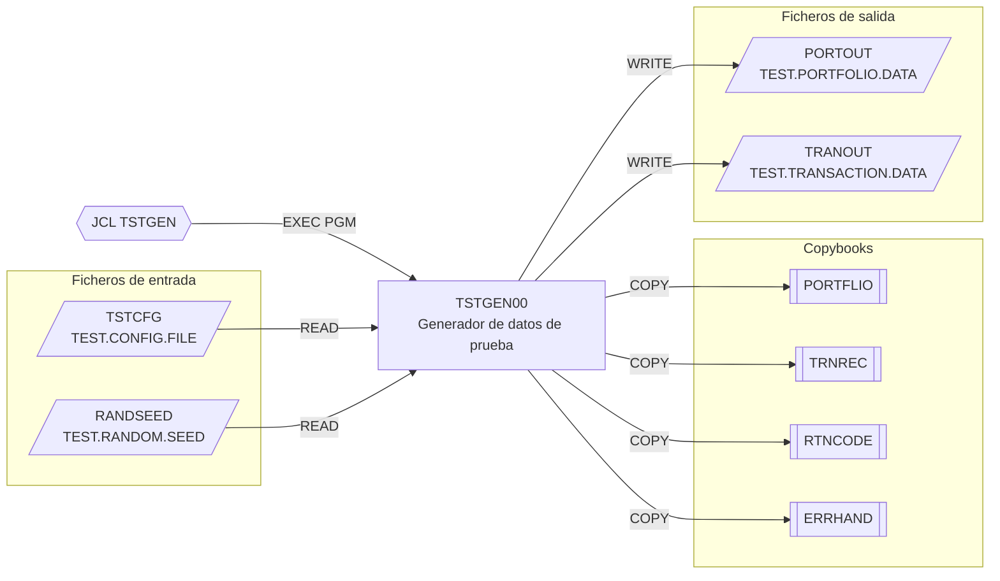

# TSTGEN00 — Generador de datos de prueba

**Fuente:** `src/programs/test/TSTGEN00.cbl` · **JCL:** `src/jcl/test/TSTGEN.jcl`

## Propósito

Genera ficheros secuenciales de datos de prueba (carteras y transacciones) a partir
de un fichero de configuración que indica el tipo de escenario y el volumen de
registros deseado. Está pensado para alimentar pruebas de sistema: datos de
carteras, escenarios de transacciones, condiciones de error y volúmenes de
rendimiento.

## Tipo

Batch (programa principal ejecutado con `EXEC PGM=TSTGEN00`). No usa CICS ni DB2.

## Entradas y salidas

| Dirección | Nombre lógico (SELECT) | DDNAME | Dataset (según JCL) | Organización | Registro |
|-----------|------------------------|--------|---------------------|--------------|----------|
| Entrada | `TEST-CONFIG` | `TSTCFG` | `TEST.CONFIG.FILE` | QSAM secuencial, RECFM=F | `CONFIG-RECORD` (80 bytes): `CFG-TEST-TYPE` X(10), `CFG-VOLUME` 9(6), `CFG-PARAMETERS` X(64) |
| Entrada | `RANDOM-SEED` | `RANDSEED` | `TEST.RANDOM.SEED` | QSAM secuencial | `SEED-RECORD` 9(9) |
| Salida | `PORTFOLIO-OUT` | `PORTOUT` | `TEST.PORTFOLIO.DATA` (NEW,CATLG) | QSAM secuencial, LRECL=100 | `PORTFOLIO-RECORD` → copybook `PORTFLIO` |
| Salida | `TRANSACTION-OUT` | `TRANOUT` | `TEST.TRANSACTION.DATA` (NEW,CATLG) | QSAM secuencial, LRECL=100 | `TRANSACTION-RECORD` → copybook `TRNREC` |

**Copybooks:** `PORTFLIO` (registro de cartera), `TRNREC` (registro de transacción),
`RTNCODE` (área de códigos de retorno), `ERRHAND` (categorías, códigos y mensajes de error).

**Tablas DB2:** ninguna. **LINKAGE SECTION:** no tiene (no recibe parámetros).

Áreas de trabajo relevantes: `WS-TEST-TYPES` (constantes `PORTFOLIO`, `TRANSACTN`,
`ERROR`, `VOLUME`), `WS-COUNTERS` (`WS-RECORDS-WRITTEN`, `WS-ERROR-COUNT`),
`WS-RANDOM-VALUES` (semilla y valores aleatorios), `WS-PORTFOLIO-DATA` y
`WS-TRANSACTION-DATA` (campos intermedios para la generación).

## Flujo principal

1. **`0000-MAIN`** — ejecuta `1000-INITIALIZE`, `2000-PROCESS`, `3000-CLEANUP` y termina con `GOBACK`.
2. **`1000-INITIALIZE`**
   1. `1100-OPEN-FILES`: abre `TEST-CONFIG` (INPUT), `PORTFOLIO-OUT` (OUTPUT), `TRANSACTION-OUT` (OUTPUT) y `RANDOM-SEED` (INPUT). Tras cada OPEN comprueba el FILE STATUS; si no es `'00'` mueve un mensaje descriptivo y ejecuta `9999-ERROR-HANDLER`.
   2. `1200-INIT-RANDOM`: lee el único registro de `RANDOM-SEED` y lo guarda en `WS-RANDOM-SEED`.
   3. `1300-INIT-COUNTERS`: `INITIALIZE WS-COUNTERS`.
3. **`2000-PROCESS`** — bucle `PERFORM UNTIL END-OF-CONFIG` leyendo `TEST-CONFIG`; por cada registro ejecuta `2100-GENERATE-TEST-DATA`; en `AT END` activa `END-OF-CONFIG`.
4. **`2100-GENERATE-TEST-DATA`** — `EVALUATE CFG-TEST-TYPE`:
   - `PORTFOLIO` → `2200-GEN-PORTFOLIO`: bucle `VARYING WS-RECORDS-WRITTEN FROM 1 BY 1 UNTIL > CFG-VOLUME` ejecutando `2210-GEN-PORT-DATA` y `2220-WRITE-PORT-RECORD`.
   - `TRANSACTN` → `2300-GEN-TRANSACTION`: mismo patrón con `2310-GEN-TRAN-DATA` y `2320-WRITE-TRAN-RECORD`.
   - `ERROR` → `2400-GEN-ERROR-DATA`: ejecuta `2410-GEN-DATA-ERRORS` y `2420-GEN-PROCESS-ERRORS`.
   - `VOLUME` → `2500-GEN-VOLUME-DATA`: ejecuta `2510-GEN-LARGE-PORTFOLIO` y `2520-GEN-LARGE-TRANSACTION`.
   - `OTHER` → mensaje `INVALID TEST TYPE` y `9999-ERROR-HANDLER`.
5. **`3000-CLEANUP`** — cierra los cuatro ficheros.
6. **`9999-ERROR-HANDLER`** — ver "Manejo de errores".

> **Estado del código:** los párrafos hoja `2210-*`, `2220-*`, `2310-*`, `2320-*`,
> `2410-*`, `2420-*`, `2510-*` y `2520-*` se invocan con `PERFORM` pero **no están
> definidos** en el fuente; el programa es un esqueleto (la generación real de datos
> no está implementada). Igualmente, `WS-ERROR-MESSAGE` se usa pero no se declara ni en
> el programa ni en `ERRHAND` (que expone `ERR-TEXT`). El programa no compilaría tal cual.

## Reglas de negocio y validaciones

- El tipo de prueba del registro de configuración debe ser uno de `PORTFOLIO`,
  `TRANSACTN`, `ERROR` o `VOLUME`; cualquier otro valor se trata como error.
- `CFG-VOLUME` fija el número de registros a generar para los tipos `PORTFOLIO` y
  `TRANSACTN`.
- La generación pretende ser reproducible: la semilla se lee de `RANDSEED`
  (`SEED-RECORD` 9(9)) en lugar de derivarse del reloj.
- Cada registro de configuración es independiente; un fichero de configuración
  puede combinar varios escenarios en una sola ejecución.
- Los ficheros de salida se crean nuevos en cada ejecución (`DISP=(NEW,CATLG,DELETE)`).

## Manejo de errores y códigos de retorno

- Todos los errores confluyen en `9999-ERROR-HANDLER`: incrementa `WS-ERROR-COUNT`,
  muestra `WS-ERROR-MESSAGE` en consola (`DISPLAY ... UPON CONS`) y **solo si el
  contador supera 100** fija `RETURN-CODE = 12` y hace `GOBACK`. Por debajo de ese
  umbral el proceso continúa (tolerante a fallos), incluso tras un OPEN fallido.
- No se comprueba el FILE STATUS de las operaciones `READ`/`WRITE`/`CLOSE`.
- Códigos de retorno: `0` (fin normal) o `12` (más de 100 errores). Los códigos
  simbólicos de `ERRHAND` (`ERR-SUCCESS`=0, `ERR-WARNING`=4, `ERR-ERROR`=8,
  `ERR-SEVERE`=12, `ERR-TERMINAL`=16) se incluyen pero no se referencian.

## Dependencias

**Es llamado por:** JCL `TSTGEN` (`src/jcl/test/TSTGEN.jcl`, `STEP01 EXEC PGM=TSTGEN00`).

**Llama a:** ningún programa (`CALL`/`LINK`/`XCTL` ausentes).

**Aristas en `deps.json` (from = TSTGEN00):**

| kind | to | detalle |
|------|----|---------|
| COPY | PORTFLIO | registro de cartera (salida) |
| COPY | TRNREC | registro de transacción (salida) |
| COPY | RTNCODE | área de códigos de retorno |
| COPY | ERRHAND | manejo de errores |
| FILE | TSTCFG | `TEST-CONFIG` |
| FILE | PORTOUT | `PORTFOLIO-OUT` |
| FILE | TRANOUT | `TRANSACTION-OUT` |
| FILE | RANDSEED | `RANDOM-SEED` |

Arista entrante: `TSTGEN --EXECPGM--> TSTGEN00`.

## Diagrama

