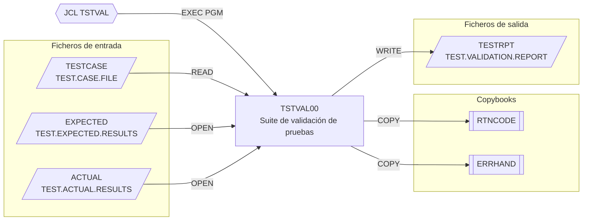

# TSTVAL00 — Suite de validación de pruebas

**Fuente:** `src/programs/test/TSTVAL00.cbl` · **JCL:** `src/jcl/test/TSTVAL.jcl`

## Propósito

Ejecuta un conjunto de casos de prueba descritos en un fichero, compara los
resultados obtenidos con los esperados y produce un informe de validación de 132
columnas con el detalle de cada caso y un resumen final (totales, aprobados,
fallidos, porcentaje de éxito y tiempo transcurrido). Cubre pruebas funcionales,
de integración, de rendimiento y de condiciones de error.

## Tipo

Batch (programa principal ejecutado con `EXEC PGM=TSTVAL00`). No usa CICS ni DB2.

## Entradas y salidas

| Dirección | Nombre lógico (SELECT) | DDNAME | Dataset (según JCL) | Organización | Registro |
|-----------|------------------------|--------|---------------------|--------------|----------|
| Entrada | `TEST-CASES` | `TESTCASE` | `TEST.CASE.FILE` | QSAM secuencial, RECFM=F | `TEST-CASE-RECORD` (170 bytes): `TEST-ID` X(10), `TEST-TYPE` X(10), `TEST-DESCRIPTION` X(50), `TEST-PARAMETERS` X(100) |
| Entrada | `EXPECTED-RESULTS` | `EXPECTED` | `TEST.EXPECTED.RESULTS` | QSAM secuencial | `EXPECTED-RECORD` X(200) |
| Entrada | `ACTUAL-RESULTS` | `ACTUAL` | `TEST.ACTUAL.RESULTS` | QSAM secuencial | `ACTUAL-RECORD` X(200) |
| Salida | `TEST-REPORT` | `TESTRPT` | `TEST.VALIDATION.REPORT` (NEW,CATLG) | QSAM secuencial, LRECL=132 | `REPORT-RECORD` X(132) |

**Copybooks:** `RTNCODE` (área de códigos de retorno), `ERRHAND` (categorías, códigos y mensajes de error).

**Tablas DB2:** ninguna. **LINKAGE SECTION:** no tiene (no recibe parámetros).

Áreas de trabajo relevantes: `WS-TEST-TYPES` (constantes `FUNCTIONAL`, `INTEGRATE`,
`PERFORM`, `ERROR`), `WS-TEST-METRICS` (totales, aprobados, fallidos, hora de
inicio/fin/transcurrido), `WS-REPORT-HEADERS`, `WS-TEST-DETAIL` (línea de detalle) y
`WS-SUMMARY-LINE` (línea de resumen con `WS-SUCCESS-RATE` `ZZ9.99`%).

## Flujo principal

1. **`0000-MAIN`** — ejecuta `1000-INITIALIZE`, `2000-PROCESS`, `3000-CLEANUP` y `GOBACK`.
2. **`1000-INITIALIZE`**
   1. `1100-OPEN-FILES`: abre `TEST-CASES`, `EXPECTED-RESULTS` y `ACTUAL-RESULTS` (INPUT) y `TEST-REPORT` (OUTPUT). Tras cada OPEN comprueba el FILE STATUS; si no es `'00'` ejecuta `9999-ERROR-HANDLER` (que aborta).
   2. `1200-WRITE-HEADERS`: escribe `WS-HEADER1` (132 asteriscos) y `WS-HEADER2` (`TEST VALIDATION REPORT` centrado) en el informe.
   3. `1300-INIT-METRICS`: `INITIALIZE WS-TEST-METRICS` y `ACCEPT WS-START-TIME FROM TIME`.
3. **`2000-PROCESS`** — bucle `PERFORM UNTIL END-OF-TESTS` leyendo `TEST-CASES`; por cada registro ejecuta `2100-EXECUTE-TEST`; al terminar el bucle ejecuta `2900-WRITE-SUMMARY`.
4. **`2100-EXECUTE-TEST`**
   1. `EVALUATE TEST-TYPE`: `FUNCTIONAL` → `2200-RUN-FUNCTIONAL-TEST`; `INTEGRATE` → `2300-RUN-INTEGRATION-TEST`; `PERFORM` → `2400-RUN-PERFORMANCE-TEST`; `ERROR` → `2500-RUN-ERROR-TEST`; `OTHER` → mensaje `INVALID TEST TYPE` y `9999-ERROR-HANDLER`.
   2. `2600-VALIDATE-RESULTS` (comparación esperado/real).
   3. `2700-UPDATE-METRICS` (actualiza contadores).
   4. `2800-WRITE-TEST-DETAIL` (línea de detalle en el informe).
5. **`2900-WRITE-SUMMARY`** — `ACCEPT WS-END-TIME FROM TIME`, calcula `WS-ELAPSED-TIME = WS-END-TIME - WS-START-TIME`, mueve los contadores a los campos editados, calcula `WS-SUCCESS-RATE = (WS-TESTS-PASSED / WS-TOTAL-TESTS) * 100` y escribe `WS-SUMMARY-LINE`.
6. **`3000-CLEANUP`** — cierra los cuatro ficheros.
7. **`9999-ERROR-HANDLER`** — ver "Manejo de errores".

> **Estado del código:** los párrafos `2200-RUN-FUNCTIONAL-TEST`, `2300-RUN-INTEGRATION-TEST`,
> `2400-RUN-PERFORMANCE-TEST`, `2500-RUN-ERROR-TEST`, `2600-VALIDATE-RESULTS`,
> `2700-UPDATE-METRICS` y `2800-WRITE-TEST-DETAIL` se invocan con `PERFORM` pero **no
> están definidos**; la ejecución y comparación de pruebas no está implementada
> (los ficheros `EXPECTED`/`ACTUAL` se abren y cierran pero nunca se leen). También
> `WS-ERROR-MESSAGE` se usa sin estar declarado (ni en el programa ni en `ERRHAND`).

## Reglas de negocio y validaciones

- El tipo de caso de prueba debe ser `FUNCTIONAL`, `INTEGRATE`, `PERFORM` o `ERROR`;
  cualquier otro valor aborta el programa con RC=12.
- Cada caso genera exactamente una línea de detalle (`TEST-ID`, `TEST-TYPE`,
  descripción y estado de 4 caracteres, p. ej. PASS/FAIL) tras las cabeceras.
- El resumen calcula el porcentaje de éxito como aprobados/total×100 (2 decimales).
  Si no hay casos (`WS-TOTAL-TESTS = 0`) la división provoca un size error no
  controlado (no hay `ON SIZE ERROR`).
- El tiempo transcurrido se obtiene por diferencia directa de `TIME` (HHMMSShh), sin
  normalizar a segundos ni tratar el cambio de día.

## Manejo de errores y códigos de retorno

- `9999-ERROR-HANDLER` es **fatal**: muestra `WS-ERROR-MESSAGE` en consola
  (`DISPLAY ... UPON CONS`), fija `RETURN-CODE = 12` y hace `GOBACK` inmediatamente,
  sin cerrar ficheros ni escribir el resumen.
- Solo se verifica el FILE STATUS de los `OPEN`; no se comprueban `READ`, `WRITE` ni `CLOSE`.
- Códigos de retorno: `0` (fin normal) o `12` (error de apertura o tipo de prueba
  inválido). Las constantes de `ERRHAND` (`ERR-SUCCESS`…`ERR-TERMINAL`) se incluyen
  pero no se referencian.

## Dependencias

**Es llamado por:** JCL `TSTVAL` (`src/jcl/test/TSTVAL.jcl`, `STEP01 EXEC PGM=TSTVAL00`).

**Llama a:** ningún programa (`CALL`/`LINK`/`XCTL` ausentes).

**Aristas en `deps.json` (from = TSTVAL00):**

| kind | to | detalle |
|------|----|---------|
| COPY | RTNCODE | área de códigos de retorno |
| COPY | ERRHAND | manejo de errores |
| FILE | TESTCASE | `TEST-CASES` |
| FILE | EXPECTED | `EXPECTED-RESULTS` |
| FILE | ACTUAL | `ACTUAL-RESULTS` |
| FILE | TESTRPT | `TEST-REPORT` |

Arista entrante: `TSTVAL --EXECPGM--> TSTVAL00`.

## Diagrama

