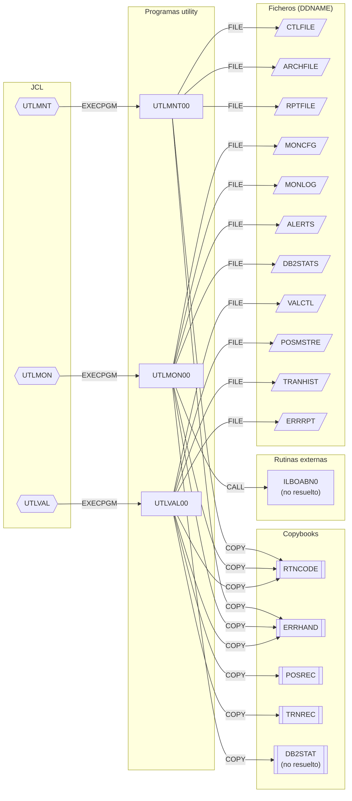

# Programas COBOL — grupo `utility`

Fuentes: `src/programs/utility/` · JCL: `src/jcl/utility/` · Aristas: `documentation/dependency-graph/deps.json`

## Resumen del grupo

El grupo `utility` agrupa tres utilidades batch de soporte a la operación del sistema de gestión de carteras. Ninguna usa CICS ni SQL embebido: trabajan exclusivamente con ficheros QSAM y VSAM, y cada una tiene su propio JCL de ejecución con un único step. Comparten el patrón *fichero de control → EVALUATE de función → párrafos especializados*, los copybooks comunes `RTNCODE` y `ERRHAND`, y un párrafo `9999-ERROR-HANDLER` propio.

Los tres fuentes son esqueletos: los párrafos de nivel superior existen, pero los párrafos hoja que realizan el trabajo real (`2210-…`, `2510-…`, etc.) se invocan con `PERFORM` sin estar definidos, y `WS-ERROR-MESSAGE` no está declarado en ningún sitio. Los detalles se recogen en cada ficha.

| Programa | Propósito | Ficha |
|---|---|---|
| `UTLMNT00` | Mantenimiento de ficheros: archivado, limpieza, reorganización VSAM y análisis de espacio dirigidos por fichero de control | [UTLMNT00.md](UTLMNT00.md) |
| `UTLMON00` | Monitor del sistema: recoge métricas CPU/memoria/DASD/DB2, compara con umbrales configurables, escribe log y alertas hasta las 23 h | [UTLMON00.md](UTLMON00.md) |
| `UTLVAL00` | Validación de datos: integridad, referencias cruzadas, formato y cuadre de saldos sobre el maestro de posiciones y el histórico de transacciones | [UTLVAL00.md](UTLVAL00.md) |

## Subgrafo de dependencias

Incluye todas las aristas de `deps.json` cuyo `from` es un programa del grupo, más las aristas `EXECPGM` de sus JCL. No hay aristas `LINK`/`XCTL`, `SQL-INCLUDE` ni tablas DB2 en este grupo.

## Discrepancias con deps.json

Ninguna. Todas las aristas extraídas coinciden con el código fuente y los JCL, incluidas las dos marcadas como no resueltas (`UTLMON00 → ILBOABN0`, rutina del runtime COBOL ajena al repositorio, y `UTLMON00 → DB2STAT`, copybook que no existe en `src/copybook/`). No se detectaron dependencias reales ausentes ni aristas espurias.

Observaciones (no son discrepancias del grafo, sino del código):

- Los tres programas invocan párrafos hoja no definidos y usan `WS-ERROR-MESSAGE` sin declararlo; no compilarían tal cual.
- `UTLMON00` usa `CALL 'ILBOABN0'` (rutina de ABEND de OS/VS COBOL) aparentemente como espera entre ciclos.
