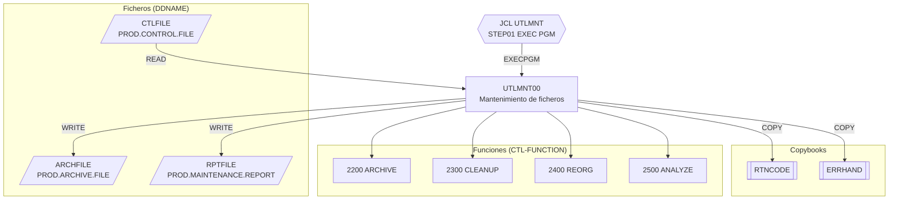

# UTLMNT00 — Utilidad de mantenimiento de ficheros

Fuente: `src/programs/utility/UTLMNT00.cbl` · JCL: `src/jcl/utility/UTLMNT.jcl`

## Propósito

Utilidad batch de mantenimiento de ficheros del sistema. Lee un fichero de control con una orden por registro y ejecuta sobre el dataset indicado una de cuatro funciones: archivado (`ARCHIVE`), limpieza (`CLEANUP`), reorganización VSAM (`REORG`) o análisis de espacio/estadísticas (`ANALYZE`). Produce un fichero de archivo y un informe de mantenimiento.

## Tipo

Batch (programa principal, `EXEC PGM=UTLMNT00` en el step `STEP01` del JCL `UTLMNT`). No usa CICS ni DB2.

## Entradas y salidas

| Dirección | Fichero lógico (FD) | DDNAME | Dataset (según JCL) | Organización | Contenido |
|---|---|---|---|---|---|
| Entrada | `CONTROL-FILE` | `CTLFILE` | `PROD.CONTROL.FILE` | QSAM secuencial, RECFM=F | `CTL-FUNCTION` X(8), `CTL-FILE-NAME` X(44), `CTL-PARAMETERS` X(100) |
| Salida | `ARCHIVE-FILE` | `ARCHFILE` | `PROD.ARCHIVE.FILE` | QSAM secuencial, RECFM=V (LRECL 32756) | `ARCHIVE-RECORD` X(32760) |
| Salida | `REPORT-FILE` | `RPTFILE` | `PROD.MAINTENANCE.REPORT` | QSAM secuencial, RECFM=F, LRECL 132 | `REPORT-RECORD` X(132) |

Copybooks (WORKING-STORAGE):

- `RTNCODE` (`src/copybook/common/RTNCODE.cpy`): área estándar de códigos de retorno (`RETURN-CODE-AREA`).
- `ERRHAND` (`src/copybook/common/ERRHAND.cpy`): categorías y códigos de error, estructura `ERR-MESSAGE` y estados VSAM.

Tablas DB2: ninguna. LINKAGE SECTION: ninguna (no recibe parámetros; el nombre del dataset objetivo viene en cada registro del fichero de control).

## Flujo principal

1. `0000-MAIN`: ejecuta `1000-INITIALIZE`, `2000-PROCESS`, `3000-CLEANUP` y termina con `GOBACK`.
2. `1000-INITIALIZE` → `1100-OPEN-FILES`: abre `CONTROL-FILE` (INPUT), `ARCHIVE-FILE` (OUTPUT) y `REPORT-FILE` (OUTPUT); tras cada OPEN comprueba el FILE STATUS y, si no es `00`, invoca `9999-ERROR-HANDLER`. `1200-INIT-PROCESSING`: inicializa `WS-COUNTERS` (leídos, escritos, errores).
3. `2000-PROCESS`: bucle `PERFORM UNTIL END-OF-CONTROL` leyendo `CONTROL-FILE`; en cada registro ejecuta `2100-PROCESS-FUNCTION`.
4. `2100-PROCESS-FUNCTION`: `EVALUATE CTL-FUNCTION`:
   - `ARCHIVE` → `2200-ARCHIVE-PROCESS`: copia `CTL-FILE-NAME` a `WS-VSAM-NAME` y encadena `2210-OPEN-VSAM`, `2220-ARCHIVE-RECORDS`, `2230-CLOSE-VSAM`.
   - `CLEANUP` → `2300-CLEANUP-PROCESS`: `2310-ANALYZE-SPACE`, `2320-DELETE-OLD`, `2330-UPDATE-CATALOG`.
   - `REORG` → `2400-REORG-PROCESS`: `2410-EXPORT-DATA`, `2420-DELETE-DEFINE`, `2430-IMPORT-DATA`.
   - `ANALYZE` → `2500-ANALYZE-PROCESS`: `2510-COLLECT-STATS`, `2520-GENERATE-REPORT`.
   - `OTHER` → mensaje `INVALID FUNCTION SPECIFIED` y `9999-ERROR-HANDLER`.
5. `3000-CLEANUP`: cierra los tres ficheros.

> Nota de implementación: en el fuente sólo existen los párrafos de nivel superior. Los párrafos hoja `2210-…` a `2520-…` se invocan con `PERFORM` pero **no están definidos** (el programa es un esqueleto). Además `WS-ERROR-MESSAGE` no se declara ni en el programa ni en `RTNCODE`/`ERRHAND`.

## Reglas de negocio y validaciones

- El valor de `CTL-FUNCTION` debe ser exactamente uno de `ARCHIVE`, `CLEANUP`, `REORG`, `ANALYZE` (comparación X(8) con las constantes de `WS-FUNCTIONS`); cualquier otro valor se trata como error pero **no detiene** el proceso (se sigue con el siguiente registro de control).
- El dataset objetivo de cada operación se toma de `CTL-FILE-NAME` (44 caracteres, longitud máxima de un DSN z/OS); `CTL-PARAMETERS` queda reservado para opciones adicionales y no se interpreta en el código actual.
- La apertura correcta de los tres ficheros es requisito previo; cualquier fallo se contabiliza como error.

## Manejo de errores y códigos de retorno

`9999-ERROR-HANDLER`:

1. Incrementa `WS-ERROR-COUNT`.
2. Muestra `WS-ERROR-MESSAGE` en consola (`DISPLAY … UPON CONS`).
3. Si `WS-ERROR-COUNT > 100`, fija `RETURN-CODE = 12` y termina con `GOBACK` (abandono por exceso de errores).

Por tanto los errores son tolerados hasta un umbral de 100; por debajo de él el programa continúa y, si no se supera, finaliza con `RETURN-CODE` 0 (no se establece ningún otro código). Un fallo de OPEN no aborta por sí mismo: sólo lo hace si acumula más de 100 errores.

## Dependencias

Según `documentation/dependency-graph/deps.json`:

| Tipo | Origen | Destino | Notas |
|---|---|---|---|
| EXECPGM | JCL `UTLMNT` | `UTLMNT00` | Job `UTLMNT.jcl`, step `STEP01` |
| COPY | `UTLMNT00` | `RTNCODE` | resuelto |
| COPY | `UTLMNT00` | `ERRHAND` | resuelto |
| FILE | `UTLMNT00` | `CTLFILE` | `CONTROL-FILE` |
| FILE | `UTLMNT00` | `ARCHFILE` | `ARCHIVE-FILE` |
| FILE | `UTLMNT00` | `RPTFILE` | `REPORT-FILE` |

- **Llama a:** ningún programa (`CALL`/`LINK`/`XCTL` ausentes).
- **Es llamado por:** únicamente el JCL `UTLMNT`. Ningún otro programa COBOL lo referencia.

## Diagrama

