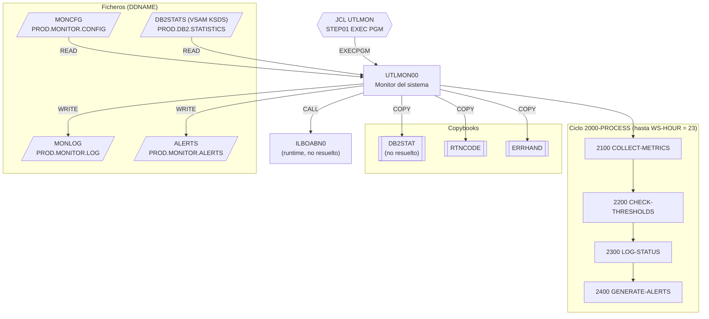

# UTLMON00 — Utilidad de monitorización del sistema

Fuente: `src/programs/utility/UTLMON00.cbl` · JCL: `src/jcl/utility/UTLMON.jcl`

## Propósito

Monitor batch de larga duración que, en ciclos repetidos hasta las 23 h, recoge métricas de utilización (CPU, memoria, DASD, DB2), las compara con los umbrales definidos en un fichero de configuración, escribe un log de estado y genera alertas cuando se supera algún umbral.

## Tipo

Batch (programa principal, `EXEC PGM=UTLMON00` en el step `STEP01` del JCL `UTLMON`). No usa CICS ni SQL embebido; las estadísticas DB2 se leen de un fichero VSAM KSDS, no de tablas.

## Entradas y salidas

| Dirección | Fichero lógico (FD) | DDNAME | Dataset (según JCL) | Organización | Contenido |
|---|---|---|---|---|---|
| Entrada | `MONITOR-CONFIG` | `MONCFG` | `PROD.MONITOR.CONFIG` | QSAM secuencial, RECFM=F | `CFG-RESOURCE-TYPE` X(10), `CFG-THRESHOLD-TYPE` X(10), `CFG-THRESHOLD-VALUE` 9(9)V99, `CFG-ALERT-LEVEL` X(10), `CFG-ALERT-ACTION` X(50) |
| Entrada | `DB2-STATS` | `DB2STATS` | `PROD.DB2.STATISTICS` | VSAM KSDS, acceso DYNAMIC, clave `STAT-KEY` | Layout en copybook `DB2STAT` (no existe en el repositorio) |
| Salida | `MONITOR-LOG` | `MONLOG` | `PROD.MONITOR.LOG` | QSAM secuencial, RECFM=F, LRECL 132 | `LOG-TIMESTAMP` X(26), `LOG-RESOURCE-TYPE` X(10), `LOG-METRIC-NAME`, `LOG-METRIC-VALUE` 9(9)V99, `LOG-STATUS` X(10) |
| Salida | `ALERT-FILE` | `ALERTS` | `PROD.MONITOR.ALERTS` | QSAM secuencial, RECFM=F, LRECL 132 | `ALERT-TIMESTAMP` X(26), `ALERT-LEVEL` X(10), `ALERT-RESOURCE` X(10), `ALERT-MESSAGE` X(80) |

Copybooks:

- `DB2STAT` (FILE SECTION): FD/registro del fichero `DB2-STATS`. **No resuelto**: no existe en `src/copybook/`.
- `RTNCODE` (`src/copybook/common/RTNCODE.cpy`): área estándar de códigos de retorno.
- `ERRHAND` (`src/copybook/common/ERRHAND.cpy`): códigos y estructura de mensajes de error.

Tablas DB2: ninguna. LINKAGE SECTION: ninguna.

Rutina externa: `CALL 'ILBOABN0' USING WS-MINUTE` (rutina de runtime del sistema, no forma parte del repositorio).

## Flujo principal

1. `0000-MAIN`: `1000-INITIALIZE`; luego `PERFORM 2000-PROCESS UNTIL WS-HOUR = 23`; `3000-CLEANUP`; `GOBACK`.
2. `1000-INITIALIZE`:
   - `1100-OPEN-FILES`: abre `MONITOR-CONFIG` (INPUT), `MONITOR-LOG` (OUTPUT), `ALERT-FILE` (OUTPUT) y `DB2-STATS` (INPUT), comprobando cada FILE STATUS y llamando a `9999-ERROR-HANDLER` si no es `00`.
   - `1200-INIT-PROCESSING`: `ACCEPT WS-TIMESTAMP FROM TIME` (rellena hora/minuto/segundo/centésima).
   - `1300-READ-CONFIG`: lee todo `MONITOR-CONFIG` hasta fin de fichero y por cada registro ejecuta `1310-STORE-CONFIG` (almacena umbrales).
3. `2000-PROCESS` (un ciclo de monitorización):
   - `2100-COLLECT-METRICS`: `2110-GET-CPU-METRICS`, `2120-GET-MEMORY-METRICS`, `2130-GET-DASD-METRICS`, `2140-GET-DB2-METRICS` → rellenan `WS-CURRENT-METRICS`.
   - `2200-CHECK-THRESHOLDS`: `2210-CHECK-UTILIZATION`, `2220-CHECK-RESPONSE`, `2230-CHECK-QUEUES`, `2240-CHECK-ERRORS` → pueden activar `THRESHOLD-MET`.
   - `2300-LOG-STATUS`: copia `WS-TIMESTAMP` a `LOG-TIMESTAMP` y ejecuta `2310-LOG-RESOURCES` y `2320-LOG-PERFORMANCE` (escritura en `MONITOR-LOG`).
   - `2400-GENERATE-ALERTS`: si `THRESHOLD-MET`, `2410-FORMAT-ALERT` y `2420-WRITE-ALERT` (escritura en `ALERT-FILE`).
   - `CALL 'ILBOABN0' USING WS-MINUTE`.
   - `1200-INIT-PROCESSING` de nuevo para refrescar la hora y reevaluar la condición de salida `WS-HOUR = 23`.
4. `3000-CLEANUP`: cierra los cuatro ficheros.

> Nota de implementación: los párrafos hoja (`1310-…`, `2110-…`–`2140-…`, `2210-…`–`2240-…`, `2310-…`, `2320-…`, `2410-…`, `2420-…`) se invocan pero **no están definidos** en el fuente; `WS-ERROR-MESSAGE` tampoco se declara. `ILBOABN0` es en realidad la rutina de ABEND del runtime COBOL (OS/VS COBOL); su uso aquí, pasando `WS-MINUTE`, parece pretender una pausa/espera entre ciclos, lo que en un entorno real provocaría un abend en cada iteración.

## Reglas de negocio y validaciones

- Recursos monitorizados (`WS-RESOURCE-TYPES`): `CPU`, `MEMORY`, `DASD`, `DB2`.
- Tipos de umbral (`WS-THRESHOLD-TYPES`): `UTIL` (utilización), `RESPONSE` (tiempo de respuesta), `QUEUE` (colas), `ERROR` (errores).
- Niveles de alerta (`WS-ALERT-LEVELS`): `INFO`, `WARNING`, `CRITICAL`; cada registro de configuración asocia recurso + tipo de umbral + valor + nivel + acción.
- Métricas mantenidas por ciclo (`WS-CURRENT-METRICS`): `WS-CPU-UTIL`, `WS-MEMORY-UTIL`, `WS-DASD-UTIL`, `WS-DB2-UTIL` (9(3)V99, porcentaje), `WS-DB2-RESP` (9(5)V99), `WS-DB2-QUEUE` y `WS-DB2-ERRORS` (9(5)).
- Sólo se genera alerta si algún chequeo activa `THRESHOLD-MET`.
- Condición de parada: el bucle termina cuando la hora del sistema (`WS-HOUR`) es 23; el programa está pensado para ejecutarse como job de día completo.

## Manejo de errores y códigos de retorno

`9999-ERROR-HANDLER`: muestra `WS-ERROR-MESSAGE` en consola, fija `RETURN-CODE = 12` y termina inmediatamente con `GOBACK`. A diferencia de `UTLMNT00`, cualquier error (en la práctica, un fallo de OPEN) es fatal y no hay umbral de tolerancia. Terminación normal: `RETURN-CODE` 0.

## Dependencias

Según `documentation/dependency-graph/deps.json`:

| Tipo | Origen | Destino | Notas |
|---|---|---|---|
| EXECPGM | JCL `UTLMON` | `UTLMON00` | Job `UTLMON.jcl`, step `STEP01` |
| CALL | `UTLMON00` | `ILBOABN0` | no resuelto (rutina de runtime externa) |
| COPY | `UTLMON00` | `DB2STAT` | no resuelto (copybook inexistente) |
| COPY | `UTLMON00` | `RTNCODE` | resuelto |
| COPY | `UTLMON00` | `ERRHAND` | resuelto |
| FILE | `UTLMON00` | `MONCFG` | `MONITOR-CONFIG` |
| FILE | `UTLMON00` | `MONLOG` | `MONITOR-LOG` |
| FILE | `UTLMON00` | `ALERTS` | `ALERT-FILE` |
| FILE | `UTLMON00` | `DB2STATS` | `DB2-STATS` |

- **Llama a:** `ILBOABN0` (CALL estático).
- **Es llamado por:** únicamente el JCL `UTLMON`.

## Diagrama

