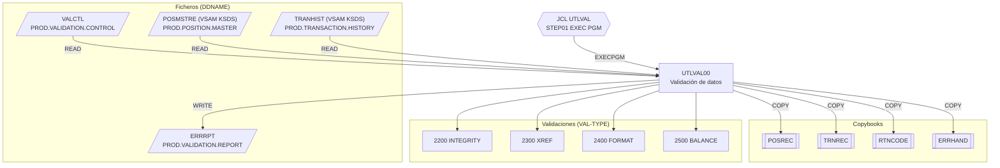

# UTLVAL00 — Utilidad de validación de datos

Fuente: `src/programs/utility/UTLVAL00.cbl` · JCL: `src/jcl/utility/UTLVAL.jcl`

## Propósito

Utilidad batch de validación de datos de negocio. Lee un fichero de control con una petición de validación por registro y ejecuta sobre el maestro de posiciones y el histórico de transacciones uno de cuatro tipos de comprobación: integridad (`INTEGRITY`), referencias cruzadas (`XREF`), formato (`FORMAT`) o cuadre de saldos (`BALANCE`). Los errores detectados se escriben en un informe.

## Tipo

Batch (programa principal, `EXEC PGM=UTLVAL00` en el step `STEP01` del JCL `UTLVAL`). No usa CICS ni DB2; accede a VSAM.

## Entradas y salidas

| Dirección | Fichero lógico (FD) | DDNAME | Dataset (según JCL) | Organización | Contenido |
|---|---|---|---|---|---|
| Entrada | `VALIDATION-CONTROL` | `VALCTL` | `PROD.VALIDATION.CONTROL` | QSAM secuencial, RECFM=F | `VAL-TYPE` X(10), `VAL-PARAMETERS` X(70) |
| Entrada | `POSITION-MASTER` | `POSMSTRE` | `PROD.POSITION.MASTER` | VSAM KSDS, acceso DYNAMIC, clave `POS-KEY` | Layout en copybook `POSREC` |
| Entrada | `TRANSACTION-HISTORY` | `TRANHIST` | `PROD.TRANSACTION.HISTORY` | VSAM KSDS, acceso DYNAMIC, clave `TRAN-KEY` | Layout en copybook `TRNREC` |
| Salida | `ERROR-REPORT` | `ERRRPT` | `PROD.VALIDATION.REPORT` | QSAM secuencial, RECFM=F, LRECL 132 | `ERROR-RECORD` X(132), escrito desde `WS-ERROR-LINE` (tipo, clave, descripción) |

Copybooks:

- `POSREC` (`src/copybook/common/POSREC.cpy`, FILE SECTION): registro del maestro de posiciones.
- `TRNREC` (`src/copybook/common/TRNREC.cpy`, FILE SECTION): registro de transacciones.
- `RTNCODE` (`src/copybook/common/RTNCODE.cpy`): área estándar de códigos de retorno.
- `ERRHAND` (`src/copybook/common/ERRHAND.cpy`): códigos y estructura de mensajes de error.

Tablas DB2: ninguna. LINKAGE SECTION: ninguna.

Comparte los ficheros `POSMSTRE` y `TRANHIST` con los programas de los grupos batch/portfolio (p. ej. `POSUPD00`, `PORTMSTR`, `PORTTRAN`), de los que es consumidor de sólo lectura.

## Flujo principal

1. `0000-MAIN`: `1000-INITIALIZE`, `2000-PROCESS`, `3000-CLEANUP`, `GOBACK`.
2. `1000-INITIALIZE`:
   - `1100-OPEN-FILES`: abre `VALIDATION-CONTROL` (INPUT), `POSITION-MASTER` (INPUT), `TRANSACTION-HISTORY` (INPUT) y `ERROR-REPORT` (OUTPUT); tras cada OPEN, si el FILE STATUS no es `00`, invoca `9999-ERROR-HANDLER`.
   - `1200-INIT-PROCESSING`: inicializa `WS-VALIDATION-TOTALS` (leídos, válidos, erróneos, importe total, total de control).
3. `2000-PROCESS`: bucle `PERFORM UNTIL END-OF-VALIDATION` leyendo `VALIDATION-CONTROL`; por cada registro `2100-PROCESS-VALIDATION`.
4. `2100-PROCESS-VALIDATION`: `EVALUATE VAL-TYPE`:
   - `INTEGRITY` → `2200-CHECK-INTEGRITY`: `2210-CHECK-POSITION-INTEGRITY`, `2220-CHECK-TRANSACTION-INTEGRITY`.
   - `XREF` → `2300-CHECK-XREF`: `2310-CHECK-POSITION-XREF`, `2320-CHECK-TRANSACTION-XREF`.
   - `FORMAT` → `2400-CHECK-FORMAT`: `2410-CHECK-POSITION-FORMAT`, `2420-CHECK-TRANSACTION-FORMAT`.
   - `BALANCE` → `2500-CHECK-BALANCE`: `2510-ACCUMULATE-POSITIONS` (acumula en `WS-TOTAL-AMOUNT`), `2520-VERIFY-BALANCES` (compara con `WS-CONTROL-TOTAL`).
   - `OTHER` → mensaje `INVALID VALIDATION TYPE` y `9999-ERROR-HANDLER`.
5. `3000-CLEANUP`: cierra los cuatro ficheros.

> Nota de implementación: los párrafos hoja `2210-…` a `2520-…` se invocan pero **no están definidos** en el fuente (esqueleto). `WS-ERROR-MESSAGE` no se declara en el programa ni en los copybooks incluidos. `WS-ERR-TYPE` y `WS-ERR-KEY` de la línea de error nunca se rellenan en el código existente.

## Reglas de negocio y validaciones

- `VAL-TYPE` debe ser uno de `INTEGRITY`, `XREF`, `FORMAT`, `BALANCE` (constantes X(10) de `WS-VALIDATION-TYPES`); un valor desconocido se registra como error en el informe y el proceso continúa con el siguiente registro de control.
- Cada tipo de validación se aplica por pares a las dos fuentes de datos (posiciones y transacciones), salvo `BALANCE`, que acumula importes de posiciones y los contrasta con un total de control (`WS-CONTROL-TOTAL`, S9(15)V99).
- Contadores de resultado en `WS-VALIDATION-TOTALS`: `WS-RECORDS-READ`, `WS-RECORDS-VALID`, `WS-RECORDS-ERROR`.
- Todos los accesos a VSAM son de sólo lectura (OPEN INPUT); el programa nunca modifica los datos que valida.

## Manejo de errores y códigos de retorno

`9999-ERROR-HANDLER`:

1. Incrementa `WS-RECORDS-ERROR`.
2. Activa el indicador `ERROR-FOUND`.
3. Copia `WS-ERROR-MESSAGE` a `WS-ERR-DESC` y escribe `ERROR-RECORD FROM WS-ERROR-LINE` en `ERROR-REPORT`.

No aborta nunca ni modifica `RETURN-CODE`: todos los errores, incluidos los de apertura de ficheros, se registran en el informe y el programa continúa hasta agotar el fichero de control, terminando con `RETURN-CODE` 0. (Si falla la apertura de `ERROR-REPORT`, el propio intento de escribir el error en ese fichero fallaría en ejecución.) El indicador `ERROR-FOUND` se activa pero no se consulta posteriormente.

## Dependencias

Según `documentation/dependency-graph/deps.json`:

| Tipo | Origen | Destino | Notas |
|---|---|---|---|
| EXECPGM | JCL `UTLVAL` | `UTLVAL00` | Job `UTLVAL.jcl`, step `STEP01` |
| COPY | `UTLVAL00` | `POSREC` | resuelto |
| COPY | `UTLVAL00` | `TRNREC` | resuelto |
| COPY | `UTLVAL00` | `RTNCODE` | resuelto |
| COPY | `UTLVAL00` | `ERRHAND` | resuelto |
| FILE | `UTLVAL00` | `VALCTL` | `VALIDATION-CONTROL` |
| FILE | `UTLVAL00` | `POSMSTRE` | `POSITION-MASTER` |
| FILE | `UTLVAL00` | `TRANHIST` | `TRANSACTION-HISTORY` |
| FILE | `UTLVAL00` | `ERRRPT` | `ERROR-REPORT` |

- **Llama a:** ningún programa.
- **Es llamado por:** únicamente el JCL `UTLVAL`.

## Diagrama

