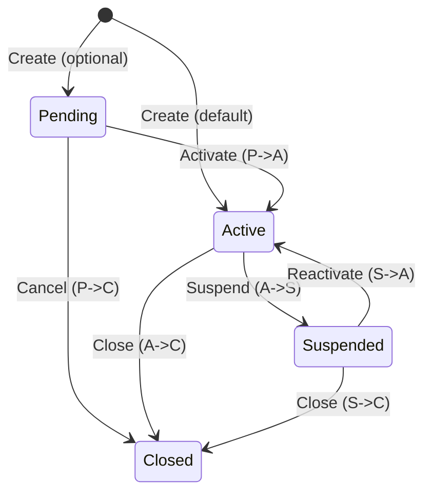

# Project Plan: Pending (`'P'`) Portfolio Status Implementation

> **Project**: COBOL Legacy Benchmark Suite (CLBS) — Investment Portfolio Management System
> **Feature**: New "Pending" Portfolio Status
> **Status Code**: `'P'`
> **Total Estimated Effort**: 78 hours (~24 stories across 6 epics)
> **Created**: 2026-03-24
> **Last Updated**: 2026-03-24

---

## Table of Contents

- [Business Decisions (Resolved)](#business-decisions-resolved)
- [Epic 1: Data Model — Add Pending Status](#epic-1-data-model--add-pending-status)
- [Epic 2: Portfolio Lifecycle Programs — Support Pending Status](#epic-2-portfolio-lifecycle-programs--support-pending-status)
- [Epic 3: Transaction Processing — Enforce Pending Guard](#epic-3-transaction-processing--enforce-pending-guard)
- [Epic 4: Batch Reporting — Display Pending Status](#epic-4-batch-reporting--display-pending-status)
- [Epic 5: Test Data and Test Cases](#epic-5-test-data-and-test-cases)
- [Epic 6: Documentation](#epic-6-documentation)
- [Summary Table](#summary-table)
- [Dependency Order](#dependency-order)

---

## Business Decisions (Resolved)

| # | Decision | Resolution |
|---|----------|------------|
| 1 | Status code | `'P'` for Pending |
| 2 | Portfolio creation | New portfolios can be created as either Pending or Active (Pending is optional, not mandatory) |
| 3 | Valid transitions | P&#8594;A (activate), P&#8594;C (cancel). **Blocked**: A&#8594;P, C&#8594;P, S&#8594;P, P&#8594;S |
| 4 | Deletion behavior | Pending portfolios **CANNOT** be deleted — must be transitioned to Closed instead |
| 5 | Deletion reason code | A new deletion reason code is **NOT** needed (since deletion of Pending is blocked) |
| 6 | Time limit | No time limit on Pending status (no auto-expiry) |
| 7 | Reporting | Pending portfolios **excluded** from operational reports, **included** in audit reports |
| 8 | Relationship to Inactive | The existing `'I'` (Inactive) status remains as-is; Pending is distinct (approved but not initialized vs. was active but deactivated) |

---

## Epic 1: Data Model — Add Pending Status

**Total Estimate**: ~8 hours

### Story 1.1: Add `PORT-PENDING` 88-level to Portfolio Copybook

| Field | Value |
|-------|-------|
| **ID** | PEND-1.1 |
| **Type** | Story |
| **Epic** | 1 — Data Model |
| **Estimate** | 2 hours |
| **Priority** | Highest |
| **Labels** | `data-model`, `copybook`, `blocking` |

**Description**

Add `88 PORT-PENDING VALUE 'P'` to the portfolio copybook `src/copybook/common/PORTFLIO.cpy` after the existing `PORT-SUSPENDED` condition on line 27. This is the foundational change — all other epics depend on this 88-level being available.

**File**: `src/copybook/common/PORTFLIO.cpy`
**Location**: After line 27 (`88 PORT-SUSPENDED VALUE 'S'.`)

**Change**:
```cobol
           10  PORT-STATUS         PIC X(1).
               88  PORT-ACTIVE       VALUE 'A'.
               88  PORT-CLOSED       VALUE 'C'.
               88  PORT-SUSPENDED    VALUE 'S'.
               88  PORT-PENDING      VALUE 'P'.
```

**Acceptance Criteria**:
- [ ] `88 PORT-PENDING VALUE 'P'` is added after line 27
- [ ] All dependent programs recompile without errors
- [ ] Existing tests continue to pass (no breakage from copybook change)

---

### Story 1.2: Update DB2 Status Code Documentation Comment

| Field | Value |
|-------|-------|
| **ID** | PEND-1.2 |
| **Type** | Story |
| **Epic** | 1 — Data Model |
| **Estimate** | 1 hour |
| **Priority** | High |
| **Labels** | `data-model`, `db2`, `documentation` |

**Description**

In `src/database/db2/db2-definitions.sql` line 100, update the status code comment to include the new Pending status.

**File**: `src/database/db2/db2-definitions.sql`
**Location**: Line 100 (Notes section)

**Change**:
```sql
-- Current:
--    - Portfolio: 'A'=Active, 'C'=Closed, 'S'=Suspended
-- Updated:
--    - Portfolio: 'A'=Active, 'C'=Closed, 'S'=Suspended, 'P'=Pending
```

**Acceptance Criteria**:
- [ ] Comment on line 100 includes `'P'=Pending`

---

### Story 1.3: Add Pending Exclusion Comment to `ACTIVE_PORTFOLIOS` View and Optionally Create `PENDING_PORTFOLIOS` View

| Field | Value |
|-------|-------|
| **ID** | PEND-1.3 |
| **Type** | Story |
| **Epic** | 1 — Data Model |
| **Estimate** | 2 hours |
| **Priority** | High |
| **Labels** | `data-model`, `db2`, `view` |

**Description**

In `src/database/db2/db2-definitions.sql` lines 82-86, add a comment to the `ACTIVE_PORTFOLIOS` view confirming that Pending portfolios are excluded by the `STATUS = 'A'` filter. Optionally create a new `PENDING_PORTFOLIOS` view.

**File**: `src/database/db2/db2-definitions.sql`
**Location**: Lines 82-86 (Views section)

**Changes**:
```sql
-- Note: Pending ('P') portfolios are intentionally excluded by the
-- STATUS = 'A' filter. Use the PENDING_PORTFOLIOS view for those records.
CREATE VIEW ACTIVE_PORTFOLIOS AS
    SELECT *
    FROM PORTFOLIO_MASTER
    WHERE STATUS = 'A'
    AND (CLOSE_DATE IS NULL OR CLOSE_DATE > CURRENT DATE);

-- New view for Pending portfolios
CREATE VIEW PENDING_PORTFOLIOS AS
    SELECT *
    FROM PORTFOLIO_MASTER
    WHERE STATUS = 'P';
```

**Acceptance Criteria**:
- [ ] Comment added to `ACTIVE_PORTFOLIOS` view confirming Pending is excluded
- [ ] New `PENDING_PORTFOLIOS` view created (optional, but recommended)
- [ ] DDL is syntactically valid

---

### Story 1.4: Update VSAM Status Code Documentation

| Field | Value |
|-------|-------|
| **ID** | PEND-1.4 |
| **Type** | Story |
| **Epic** | 1 — Data Model |
| **Estimate** | 1 hour |
| **Priority** | Medium |
| **Labels** | `data-model`, `vsam`, `documentation` |

**Description**

In `src/database/vsam/vsam-definitions.txt`, add `'P'=Pending` to the status code documentation comments.

**File**: `src/database/vsam/vsam-definitions.txt`

**Change**: Add `'P'=Pending` to the valid status values list wherever portfolio status codes are documented.

**Acceptance Criteria**:
- [ ] `'P'=Pending` is listed in VSAM status code documentation

---

### Story 1.5: Review DB2 Cursor Definitions for Pending Handling

| Field | Value |
|-------|-------|
| **ID** | PEND-1.5 |
| **Type** | Story |
| **Epic** | 1 — Data Model |
| **Estimate** | 2 hours |
| **Priority** | Medium |
| **Labels** | `data-model`, `db2`, `review` |

**Description**

In `src/templates/database/db2-handling.cbl` (line 157 area), review all cursor definitions that filter on STATUS and add comments confirming Pending is correctly handled (excluded from active queries).

**File**: `src/templates/database/db2-handling.cbl`
**Location**: Line 157 area (cursor definitions)

**Acceptance Criteria**:
- [ ] All STATUS-filtering cursors reviewed
- [ ] Comments added confirming Pending exclusion where appropriate
- [ ] No cursor inadvertently includes or excludes Pending incorrectly

---

## Epic 2: Portfolio Lifecycle Programs — Support Pending Status

**Total Estimate**: ~24 hours

### Story 2.1: Add `'P'` to `VALID-STATUS` in PORTMSTR

| Field | Value |
|-------|-------|
| **ID** | PEND-2.1 |
| **Type** | Story |
| **Epic** | 2 — Portfolio Lifecycle |
| **Estimate** | 2 hours |
| **Priority** | Highest |
| **Labels** | `lifecycle`, `validation`, `PORTMSTR` |

**Description**

In `src/programs/portfolio/PORTMSTR.cbl` line 59, add `'P'` to the valid status values so the master file maintenance program accepts Pending as a valid portfolio status.

**File**: `src/programs/portfolio/PORTMSTR.cbl`
**Location**: Line 59

**Change**:
```cobol
-- Current (line 59):
       05  WS-VALID-STATUS     PIC X(01).
           88  VALID-STATUS    VALUE 'A' 'I' 'C'.

-- Updated:
       05  WS-VALID-STATUS     PIC X(01).
           88  VALID-STATUS    VALUE 'A' 'I' 'C' 'P'.
```

**Acceptance Criteria**:
- [ ] `'P'` added to VALID-STATUS 88-level values
- [ ] PORTMSTR accepts `'P'` as valid during validation (paragraph `2100-VALIDATE-PORTFOLIO`)
- [ ] All four CRUD operations work correctly with Pending portfolios

---

### Story 2.2: Allow Pending Status in PORTADD Validation

| Field | Value |
|-------|-------|
| **ID** | PEND-2.2 |
| **Type** | Story |
| **Epic** | 2 — Portfolio Lifecycle |
| **Estimate** | 4 hours |
| **Priority** | Highest |
| **Labels** | `lifecycle`, `validation`, `PORTADD` |

**Description**

In `src/programs/portfolio/PORTADD.cbl` line 116, change the validation from `PORT-STATUS NOT EQUAL 'A'` to allow both `'A'` and `'P'`. When status is `'P'`, ensure `PORT-TOTAL-VALUE` and `PORT-CASH-BALANCE` are initialized to zero (since the portfolio is not yet active).

**File**: `src/programs/portfolio/PORTADD.cbl`
**Location**: Line 116 (paragraph `2100-VALIDATE-AND-ADD`)

**Change**:
```cobol
-- Current (line 116):
       IF PORT-ID EQUAL SPACES OR
          PORT-CLIENT-NAME EQUAL SPACES OR
          PORT-STATUS NOT EQUAL 'A'
           ADD 1 TO WS-ERROR-COUNT
           ...

-- Updated:
       IF PORT-ID EQUAL SPACES OR
          PORT-CLIENT-NAME EQUAL SPACES OR
          (PORT-STATUS NOT EQUAL 'A' AND
           PORT-STATUS NOT EQUAL 'P')
           ADD 1 TO WS-ERROR-COUNT
           ...

-- Additionally, after validation passes:
       IF PORT-STATUS EQUAL 'P'
           MOVE ZERO TO PORT-TOTAL-VALUE
           MOVE ZERO TO PORT-CASH-BALANCE
       END-IF
```

**Acceptance Criteria**:
- [ ] Portfolios with `PORT-STATUS = 'P'` are accepted during addition
- [ ] Portfolios with `PORT-STATUS = 'A'` continue to work as before
- [ ] Pending portfolios are created with zero `PORT-TOTAL-VALUE` and `PORT-CASH-BALANCE`
- [ ] Invalid statuses (other than `'A'` and `'P'`) are still rejected

---

### Story 2.3: Add Status Transition Validation in PORTUPDT

| Field | Value |
|-------|-------|
| **ID** | PEND-2.3 |
| **Type** | Story |
| **Epic** | 2 — Portfolio Lifecycle |
| **Estimate** | 8 hours |
| **Priority** | Highest |
| **Labels** | `lifecycle`, `transitions`, `PORTUPDT`, `critical` |

**Description**

In `src/programs/portfolio/PORTUPDT.cbl`, add status transition validation in the `2200-APPLY-UPDATE` paragraph (around line 131). When `UPDT-STATUS` is true, before applying the new status value, add an EVALUATE block that checks the current `PORT-STATUS` against the new value and enforces the allowed transition rules.

**File**: `src/programs/portfolio/PORTUPDT.cbl`
**Location**: Paragraph `2200-APPLY-UPDATE` (line 131)

**Transition Rules**:

| From | To | Allowed? | Error Message |
|------|----|----------|---------------|
| P | A | Yes | _(activate)_ |
| P | C | Yes | _(cancel)_ |
| P | S | **No** | `"Cannot suspend a Pending portfolio"` |
| A | P | **No** | `"Cannot revert Active portfolio to Pending"` |
| C | P | **No** | `"Cannot revert Closed portfolio to Pending"` |
| S | P | **No** | `"Cannot revert Suspended portfolio to Pending"` |
| A | S | Yes | _(existing — unchanged)_ |
| A | C | Yes | _(existing — unchanged)_ |
| S | A | Yes | _(existing — unchanged)_ |
| S | C | Yes | _(existing — unchanged)_ |

**Change** (pseudocode for the EVALUATE block):
```cobol
       2200-APPLY-UPDATE.
           EVALUATE TRUE
               WHEN UPDT-STATUS
      *            Validate status transition before applying
                   EVALUATE PORT-STATUS
                       WHEN 'P'
                           IF UPDT-NEW-VALUE = 'A' OR
                              UPDT-NEW-VALUE = 'C'
                               CONTINUE
                           ELSE IF UPDT-NEW-VALUE = 'S'
                               ADD 1 TO WS-ERROR-COUNT
                               DISPLAY 'Cannot suspend a Pending '
                                       'portfolio: ' PORT-KEY
                               EXIT PARAGRAPH
                           END-IF
                       WHEN 'A'
                           IF UPDT-NEW-VALUE = 'P'
                               ADD 1 TO WS-ERROR-COUNT
                               DISPLAY 'Cannot revert Active '
                                       'portfolio to Pending: '
                                       PORT-KEY
                               EXIT PARAGRAPH
                           END-IF
                       WHEN 'C'
                           IF UPDT-NEW-VALUE = 'P'
                               ADD 1 TO WS-ERROR-COUNT
                               DISPLAY 'Cannot revert Closed '
                                       'portfolio to Pending: '
                                       PORT-KEY
                               EXIT PARAGRAPH
                           END-IF
                       WHEN 'S'
                           IF UPDT-NEW-VALUE = 'P'
                               ADD 1 TO WS-ERROR-COUNT
                               DISPLAY 'Cannot revert Suspended '
                                       'portfolio to Pending: '
                                       PORT-KEY
                               EXIT PARAGRAPH
                           END-IF
                   END-EVALUATE
                   MOVE UPDT-NEW-VALUE TO PORT-STATUS
               WHEN UPDT-NAME
                   MOVE UPDT-NEW-VALUE TO PORT-CLIENT-NAME
               WHEN UPDT-VALUE
                   MOVE UPDT-NEW-VALUE TO WS-NUMERIC-WORK
                   MOVE WS-NUMERIC-WORK TO PORT-TOTAL-VALUE
           END-EVALUATE
           ...
```

**Acceptance Criteria**:
- [ ] P&#8594;A transition succeeds (activate)
- [ ] P&#8594;C transition succeeds (cancel)
- [ ] P&#8594;S transition is blocked with error message `"Cannot suspend a Pending portfolio"`
- [ ] A&#8594;P transition is blocked with error message `"Cannot revert Active portfolio to Pending"`
- [ ] C&#8594;P transition is blocked with error message `"Cannot revert Closed portfolio to Pending"`
- [ ] S&#8594;P transition is blocked with error message `"Cannot revert Suspended portfolio to Pending"`
- [ ] All existing transitions (A&#8594;S, A&#8594;C, S&#8594;A, S&#8594;C) remain unchanged

---

### Story 2.4: Block Deletion of Pending Portfolios in PORTDEL

| Field | Value |
|-------|-------|
| **ID** | PEND-2.4 |
| **Type** | Story |
| **Epic** | 2 — Portfolio Lifecycle |
| **Estimate** | 4 hours |
| **Priority** | Highest |
| **Labels** | `lifecycle`, `deletion`, `PORTDEL`, `critical` |

**Description**

In `src/programs/portfolio/PORTDEL.cbl`, add a status check in `2100-PROCESS-DELETE` (after the successful READ around line 145). After reading the portfolio record, check if `PORT-STATUS = 'P'`. If so, increment `WS-ERROR-COUNT`, display an error message, and `EXIT PARAGRAPH` instead of performing `2200-DELETE-RECORD`.

**File**: `src/programs/portfolio/PORTDEL.cbl`
**Location**: Paragraph `2100-PROCESS-DELETE`, after the `WHEN WS-SUCCESS-STATUS` branch (line 145)

**Change**:
```cobol
       2100-PROCESS-DELETE.
           MOVE DEL-KEY TO PORT-KEY

           READ PORTFOLIO-FILE

           EVALUATE TRUE
               WHEN WS-SUCCESS-STATUS
      *            Check if portfolio is Pending — block deletion
                   IF PORT-STATUS = 'P'
                       ADD 1 TO WS-ERROR-COUNT
                       DISPLAY 'Cannot delete Pending portfolio'
                               ' - use status change to Close: '
                               PORT-KEY
                       EXIT PARAGRAPH
                   END-IF
                   PERFORM 2200-DELETE-RECORD
               WHEN WS-REC-NOT-FND
                   ADD 1 TO WS-NOT-FND-COUNT
                   DISPLAY 'Record not found: ' PORT-KEY
               WHEN OTHER
                   ADD 1 TO WS-ERROR-COUNT
                   DISPLAY 'Read error for: ' PORT-KEY
           END-EVALUATE
           .
```

**Acceptance Criteria**:
- [ ] Attempting to delete a Pending portfolio is rejected
- [ ] Error message displayed: `"Cannot delete Pending portfolio - use status change to Close: [PORT-KEY]"`
- [ ] `WS-ERROR-COUNT` is incremented
- [ ] Deletion of Active, Closed, and Suspended portfolios continues to work as before
- [ ] The rejected deletion is captured in the audit trail

---

### Story 2.5: Add "PENDING" Display Label in PORTREAD

| Field | Value |
|-------|-------|
| **ID** | PEND-2.5 |
| **Type** | Story |
| **Epic** | 2 — Portfolio Lifecycle |
| **Estimate** | 3 hours |
| **Priority** | High |
| **Labels** | `lifecycle`, `display`, `PORTREAD` |

**Description**

In `src/programs/portfolio/PORTREAD.cbl`, add display logic to show `"PENDING"` as a human-readable label when `PORT-STATUS = 'P'`. Find the EVALUATE or IF block that maps status codes to display labels and add the Pending case.

**File**: `src/programs/portfolio/PORTREAD.cbl`

**Change**: Add a new WHEN/IF branch for `'P'` that maps to the display label `"PENDING"`.

**Acceptance Criteria**:
- [ ] `PORT-STATUS = 'P'` displays as `"PENDING"` in output
- [ ] All other status display labels remain unchanged

---

### Story 2.6: Write Audit Trail Entry for P&#8594;A Activation

| Field | Value |
|-------|-------|
| **ID** | PEND-2.6 |
| **Type** | Story |
| **Epic** | 2 — Portfolio Lifecycle |
| **Estimate** | 3 hours |
| **Priority** | High |
| **Labels** | `lifecycle`, `audit`, `PORTUPDT` |

**Description**

Write a new audit trail entry when a portfolio transitions from Pending to Active (P&#8594;A activation). In PORTUPDT, after successfully applying a P&#8594;A status change, write a history record using the HISTREC copybook with `HIST-TYPE-PORT` (`'PT'`), `HIST-ACTION-CHG` (`'C'`), and capture before-image (status `'P'`) and after-image (status `'A'`).

**File**: `src/programs/portfolio/PORTUPDT.cbl`
**Location**: After successful P&#8594;A status change in `2200-APPLY-UPDATE`

**Acceptance Criteria**:
- [ ] P&#8594;A activation writes an audit record
- [ ] Audit record includes `HIST-TYPE-PORT = 'PT'`, `HIST-ACTION-CHG = 'C'`
- [ ] Before-image captures `PORT-STATUS = 'P'`
- [ ] After-image captures `PORT-STATUS = 'A'`
- [ ] P&#8594;C cancellation also writes an appropriate audit record

---

## Epic 3: Transaction Processing — Enforce Pending Guard

**Total Estimate**: ~8 hours

### Story 3.1: Block All Transactions Against Non-Active Portfolios in PORTTRAN

| Field | Value |
|-------|-------|
| **ID** | PEND-3.1 |
| **Type** | Story |
| **Epic** | 3 — Transaction Processing |
| **Estimate** | 4 hours |
| **Priority** | Highest |
| **Labels** | `transactions`, `guard`, `PORTTRAN`, `critical` |

**Description**

In `src/programs/portfolio/PORTTRAN.cbl`, in paragraph `2110-CHECK-PORTFOLIO` (after the successful READ around line 133), add a check: if `PORT-STATUS NOT EQUAL 'A'`, then populate `ERR-TEXT` with the portfolio status and exit the paragraph. This blocks all transaction types (BU, SL, TR, FE) against Pending, Closed, and Suspended portfolios.

**File**: `src/programs/portfolio/PORTTRAN.cbl`
**Location**: Paragraph `2110-CHECK-PORTFOLIO`, after successful READ (line 133)

**Change**:
```cobol
       2110-CHECK-PORTFOLIO.
           IF TRN-PORTFOLIO-ID = SPACES
               MOVE 'Portfolio ID is required' TO ERR-TEXT
               EXIT PARAGRAPH
           END-IF

           MOVE TRN-PORTFOLIO-ID TO PORT-ID
           READ PORTFOLIO-FILE
               INVALID KEY
                   STRING 'Invalid Portfolio ID: '
                          TRN-PORTFOLIO-ID
                     DELIMITED BY SIZE
                     INTO ERR-TEXT
           END-READ

      *    Block transactions on non-Active portfolios
           IF ERR-TEXT = SPACES
               IF PORT-STATUS NOT EQUAL 'A'
                   STRING 'Portfolio not Active - status: '
                          PORT-STATUS
                     DELIMITED BY SIZE
                     INTO ERR-TEXT
               END-IF
           END-IF
           .
```

**Acceptance Criteria**:
- [ ] Buy transactions on Pending portfolios are rejected
- [ ] Sell transactions on Pending portfolios are rejected
- [ ] Transfer transactions on Pending portfolios are rejected
- [ ] Fee transactions on Pending portfolios are rejected
- [ ] Transactions on Active portfolios continue to work
- [ ] Error message includes the current portfolio status code

---

### Story 3.2: Audit Trail for Rejected Transactions

| Field | Value |
|-------|-------|
| **ID** | PEND-3.2 |
| **Type** | Story |
| **Epic** | 3 — Transaction Processing |
| **Estimate** | 4 hours |
| **Priority** | High |
| **Labels** | `transactions`, `audit`, `PORTTRAN` |

**Description**

Ensure the audit trail captures rejected transactions. After the status check rejection in Story 3.1, write an audit record with action type `'TRAN'`, status `'FAIL'`, and a message indicating the portfolio status prevented the transaction. Use the AUDITLOG copybook fields: `AUD-TRANSACTION`, `AUD-FAILURE`, and populate `AUD-MESSAGE` with the rejection reason.

**File**: `src/programs/portfolio/PORTTRAN.cbl`
**Location**: After the status check rejection block added in Story 3.1

**Acceptance Criteria**:
- [ ] Rejected transactions generate an audit record
- [ ] Audit record type is `'TRAN'` with status `'FAIL'`
- [ ] `AUD-MESSAGE` includes the rejection reason and portfolio status
- [ ] Audit records for successful transactions are unchanged

---

## Epic 4: Batch Reporting — Display Pending Status

**Total Estimate**: ~12 hours

### Story 4.1: Exclude Pending Portfolios from Position Report

| Field | Value |
|-------|-------|
| **ID** | PEND-4.1 |
| **Type** | Story |
| **Epic** | 4 — Batch Reporting |
| **Estimate** | 4 hours |
| **Priority** | High |
| **Labels** | `reporting`, `position`, `RPTPOS00` |

**Description**

In the position report program (`src/programs/reports/RPTPOS00.cbl` or similar in `src/programs/batch/RPTPOS00.cbl`), ensure Pending portfolios are excluded from the daily position report. Add a status check that skips records where `PORT-STATUS = 'P'`. Add a summary line at the end: `"Pending portfolios excluded from report: [count]"`.

**File**: `src/programs/batch/RPTPOS00.cbl` (or `src/programs/reports/RPTPOS00.cbl`)

**Acceptance Criteria**:
- [ ] Pending portfolios are excluded from the position report output
- [ ] A counter tracks how many Pending portfolios were skipped
- [ ] Summary line displays: `"Pending portfolios excluded from report: [count]"`
- [ ] Active, Suspended, and Closed portfolios continue to appear as before

---

### Story 4.2: Ensure Pending Events Appear in Audit Report

| Field | Value |
|-------|-------|
| **ID** | PEND-4.2 |
| **Type** | Story |
| **Epic** | 4 — Batch Reporting |
| **Estimate** | 4 hours |
| **Priority** | High |
| **Labels** | `reporting`, `audit`, `RPTAUD00` |

**Description**

In the audit report program (`src/programs/batch/RPTAUD00.cbl` or `src/programs/reports/RPTAUD00.cbl`), ensure Pending-related audit events (creation, activation, cancellation) are included and clearly labeled. No filtering needed — just verify the display handles the `'P'` status code with a readable label.

**File**: `src/programs/batch/RPTAUD00.cbl` (or `src/programs/reports/RPTAUD00.cbl`)

**Acceptance Criteria**:
- [ ] Pending-related audit events are displayed in the audit report
- [ ] Status code `'P'` is displayed with a readable label (e.g., `"PENDING"`)
- [ ] Creation, activation (P&#8594;A), and cancellation (P&#8594;C) events are clearly labeled

---

### Story 4.3: Add Pending Counter to Statistics Report

| Field | Value |
|-------|-------|
| **ID** | PEND-4.3 |
| **Type** | Story |
| **Epic** | 4 — Batch Reporting |
| **Estimate** | 4 hours |
| **Priority** | High |
| **Labels** | `reporting`, `statistics`, `RPTSTA00` |

**Description**

In the statistics report program (`src/programs/batch/RPTSTA00.cbl` or `src/programs/reports/RPTSTA00.cbl`), add a new counter for Pending portfolios. The report should show: Active count, Pending count, Suspended count, Closed count, and Total count.

**File**: `src/programs/batch/RPTSTA00.cbl` (or `src/programs/reports/RPTSTA00.cbl`)

**Acceptance Criteria**:
- [ ] New `WS-PENDING-COUNT` (or equivalent) counter added
- [ ] Report output includes Pending count alongside Active, Suspended, and Closed counts
- [ ] Total count includes Pending portfolios

---

## Epic 5: Test Data and Test Cases

**Total Estimate**: ~16 hours

### Story 5.1: Update PORTTEST to Include Pending Status

| Field | Value |
|-------|-------|
| **ID** | PEND-5.1 |
| **Type** | Story |
| **Epic** | 5 — Test Data |
| **Estimate** | 2 hours |
| **Priority** | High |
| **Labels** | `testing`, `data-gen`, `PORTTEST` |

**Description**

In `src/programs/portfolio/PORTTEST.cbl` line 38, change `WS-STATUS-TYPES PIC X(3) VALUE 'ACS'` to `PIC X(4) VALUE 'ACSP'`. Update the random status selection logic (around line 103) to use `FUNCTION RANDOM * 4 + 1` instead of `* 3 + 1` to include the fourth status.

**File**: `src/programs/portfolio/PORTTEST.cbl`
**Location**: Line 38 and line 103

**Changes**:
```cobol
-- Line 38 (current):
       05  WS-STATUS-TYPES     PIC X(3) VALUE 'ACS'.
-- Line 38 (updated):
       05  WS-STATUS-TYPES     PIC X(4) VALUE 'ACSP'.

-- Line 103 (current):
       COMPUTE WS-STATUS-SUB = FUNCTION RANDOM * 3 + 1
-- Line 103 (updated):
       COMPUTE WS-STATUS-SUB = FUNCTION RANDOM * 4 + 1
```

**Acceptance Criteria**:
- [ ] `WS-STATUS-TYPES` includes `'P'` as fourth value
- [ ] Random generation produces all four statuses (A, C, S, P)
- [ ] Generated test data includes approximately 25% Pending portfolios

---

### Story 5.2: Update TSTGEN00 to Generate Pending Portfolios

| Field | Value |
|-------|-------|
| **ID** | PEND-5.2 |
| **Type** | Story |
| **Epic** | 5 — Test Data |
| **Estimate** | 2 hours |
| **Priority** | High |
| **Labels** | `testing`, `data-gen`, `TSTGEN00` |

**Description**

In `src/programs/test/TSTGEN00.cbl`, update the portfolio generation logic to include `'P'` as a possible `PORT-STATUS` value. Ensure Pending portfolios are generated with zero `PORT-TOTAL-VALUE` and `PORT-CASH-BALANCE`.

**File**: `src/programs/test/TSTGEN00.cbl`

**Acceptance Criteria**:
- [ ] `'P'` is included as a possible generated status
- [ ] Pending portfolios have `PORT-TOTAL-VALUE = 0` and `PORT-CASH-BALANCE = 0`
- [ ] Active portfolios continue to be generated with non-zero financial values

---

### Story 5.3: Create Comprehensive Test Cases for Pending Status

| Field | Value |
|-------|-------|
| **ID** | PEND-5.3 |
| **Type** | Story |
| **Epic** | 5 — Test Data |
| **Estimate** | 8 hours |
| **Priority** | High |
| **Labels** | `testing`, `test-cases`, `comprehensive` |

**Description**

Create test cases documented in `documentation/operations/test-cases-pending-status.md` or implemented as test COBOL programs. The following test scenarios must be covered:

| TC# | Test Case | Expected Result |
|-----|-----------|-----------------|
| TC1 | Create a portfolio with status `'P'` | Success |
| TC2 | Attempt Buy transaction on Pending portfolio | Rejection |
| TC3 | Attempt Sell transaction on Pending portfolio | Rejection |
| TC4 | Activate Pending portfolio (P&#8594;A) | Success |
| TC5 | Transact on now-Active portfolio (after P&#8594;A) | Success |
| TC6 | Attempt to revert Active to Pending (A&#8594;P) | Rejection |
| TC7 | Cancel Pending portfolio (P&#8594;C) | Success |
| TC8 | Attempt to delete Pending portfolio | Rejection with error message |
| TC9 | Attempt to suspend Pending portfolio (P&#8594;S) | Rejection |
| TC10 | Verify Pending portfolio excluded from `ACTIVE_PORTFOLIOS` view | Excluded |
| TC11 | Verify Pending portfolio excluded from position report | Excluded |
| TC12 | Verify Pending portfolio appears in audit report | Included |

**Acceptance Criteria**:
- [ ] All 12 test cases documented with steps, expected results, and pass/fail criteria
- [ ] Test cases cover positive scenarios (TC1, TC4, TC5, TC7)
- [ ] Test cases cover negative scenarios (TC2, TC3, TC6, TC8, TC9)
- [ ] Test cases cover reporting behavior (TC10, TC11, TC12)

---

### Story 5.4: Update Test Data Specs Documentation

| Field | Value |
|-------|-------|
| **ID** | PEND-5.4 |
| **Type** | Story |
| **Epic** | 5 — Test Data |
| **Estimate** | 4 hours |
| **Priority** | Medium |
| **Labels** | `testing`, `documentation` |

**Description**

In `documentation/operations/test-data-specs.md` lines 99-105, add `'P' = Pending` to the valid status values list. Add a new section describing test data requirements for Pending portfolios (zero balances, no positions, no transactions).

**File**: `documentation/operations/test-data-specs.md`
**Location**: Lines 99-105 (valid status values section)

**Acceptance Criteria**:
- [ ] `'P' = Pending` listed in valid status values
- [ ] New section documents Pending portfolio test data requirements:
  - Zero `PORT-TOTAL-VALUE`
  - Zero `PORT-CASH-BALANCE`
  - No positions
  - No transactions

---

## Epic 6: Documentation

**Total Estimate**: ~10 hours

### Story 6.1: Update Data Dictionary with Pending Status

| Field | Value |
|-------|-------|
| **ID** | PEND-6.1 |
| **Type** | Story |
| **Epic** | 6 — Documentation |
| **Estimate** | 3 hours |
| **Priority** | High |
| **Labels** | `documentation`, `data-dictionary` |

**Description**

In `documentation/technical/data-dictionary.md`, add `'P' = Pending` to the status codes section (around line 101). Add a new subsection documenting the Pending status: definition ("approved but not yet initialized"), constraints (no transactions, no positions, zero balances), and valid transitions.

**File**: `documentation/technical/data-dictionary.md`
**Location**: Around line 101 (status codes section)

**Acceptance Criteria**:
- [ ] `'P' = Pending` added to status codes table
- [ ] New subsection documents:
  - Definition: "Approved but not yet initialized"
  - Constraints: No transactions, no positions, zero balances
  - Valid transitions: P&#8594;A, P&#8594;C
  - Blocked transitions: A&#8594;P, C&#8594;P, S&#8594;P, P&#8594;S

---

### Story 6.2: Create Portfolio Status Transition Diagram

| Field | Value |
|-------|-------|
| **ID** | PEND-6.2 |
| **Type** | Story |
| **Epic** | 6 — Documentation |
| **Estimate** | 3 hours |
| **Priority** | High |
| **Labels** | `documentation`, `diagram`, `transitions` |

**Description**

Create a new status transition diagram document at `documentation/technical/portfolio-status-transitions.md`. Document all valid and blocked transitions with a text-based or Mermaid diagram.

**File**: `documentation/technical/portfolio-status-transitions.md` _(new file)_

**Content** should include:



**Blocked Transitions** (must also be documented):

| From | To | Reason |
|------|----|--------|
| A | P | Cannot revert Active to Pending |
| C | P | Cannot revert Closed to Pending |
| S | P | Cannot revert Suspended to Pending |
| C | A | Cannot reactivate Closed portfolio |
| C | S | Cannot suspend Closed portfolio |
| P | S | Cannot suspend Pending portfolio |

**Acceptance Criteria**:
- [ ] Diagram shows all valid transitions
- [ ] Blocked transitions are documented with reasons
- [ ] File created at `documentation/technical/portfolio-status-transitions.md`

---

### Story 6.3: Update Test Data Specifications

| Field | Value |
|-------|-------|
| **ID** | PEND-6.3 |
| **Type** | Story |
| **Epic** | 6 — Documentation |
| **Estimate** | 2 hours |
| **Priority** | Medium |
| **Labels** | `documentation`, `test-data` |

**Description**

Update `documentation/operations/test-data-specs.md` to include Pending status in all relevant sections — status code lists, sample data descriptions, and validation rules.

**File**: `documentation/operations/test-data-specs.md`

**Acceptance Criteria**:
- [ ] All status code references include `'P' = Pending`
- [ ] Sample data sections reflect Pending portfolios
- [ ] Validation rules mention Pending-specific constraints

---

### Story 6.4: Update README with Pending Status

| Field | Value |
|-------|-------|
| **ID** | PEND-6.4 |
| **Type** | Story |
| **Epic** | 6 — Documentation |
| **Estimate** | 2 hours |
| **Priority** | Medium |
| **Labels** | `documentation`, `readme` |

**Description**

Update the `README.md` if it contains any description of portfolio statuses or lifecycle, to mention the new Pending status.

**File**: `README.md`

**Acceptance Criteria**:
- [ ] Any status code listings in README include `'P' = Pending`
- [ ] Portfolio lifecycle description mentions the Pending state
- [ ] No misleading references to only three statuses

---

## Summary Table

| Epic | Description | Stories | Estimated Hours |
|------|-------------|---------|-----------------|
| 1 | Data Model — Add Pending Status | 5 | 8 |
| 2 | Portfolio Lifecycle Programs — Support Pending Status | 6 | 24 |
| 3 | Transaction Processing — Enforce Pending Guard | 2 | 8 |
| 4 | Batch Reporting — Display Pending Status | 3 | 12 |
| 5 | Test Data and Test Cases | 4 | 16 |
| 6 | Documentation | 4 | 10 |
| **Total** | | **24 stories** | **78 hours** |

---

## Dependency Order

```
Epic 1: Data Model (MUST complete first)
  |
  +---> Epic 2: Portfolio Lifecycle  ---|
  |                                     |
  +---> Epic 3: Transaction Guard   ----|---> Epic 5: Test Data & Cases
  |                                     |
  +---> Epic 4: Batch Reporting     ----|
                                        |
                                        +---> Epic 6: Documentation (finalize last)
```

1. **Epic 1** must be completed first — all other epics depend on the copybook change (Story 1.1) and data model updates.
2. **Epics 2, 3, and 4** can proceed **in parallel** after Epic 1 is complete.
3. **Epic 5** depends on Epics 2 and 3 being complete (test cases validate lifecycle and transaction behaviors).
4. **Epic 6** should be finalized last, after all code changes are done, to ensure documentation accurately reflects the implementation.

---

## Risk Register

| Risk | Impact | Mitigation |
|------|--------|------------|
| Copybook change breaks dependent programs | High | Story 1.1 includes recompilation of all dependents |
| Missing cursor/query filters for Pending | Medium | Story 1.5 explicitly reviews all DB2 cursors |
| Incomplete transition validation | High | Story 5.3 (TC6, TC9) specifically tests blocked transitions |
| Audit trail gaps | Medium | Stories 2.6, 3.2 ensure audit coverage for new paths |
| Report inaccuracies | Medium | Stories 4.1-4.3 and TC10-TC12 verify report behavior |

---

## Sprint Planning Recommendation

| Sprint | Epics | Focus |
|--------|-------|-------|
| Sprint 1 (Week 1) | Epic 1 (all stories) | Data model foundation |
| Sprint 2 (Week 2-3) | Epic 2 (Stories 2.1-2.4) | Core lifecycle — critical path |
| Sprint 3 (Week 3-4) | Epic 2 (Stories 2.5-2.6), Epic 3 | Remaining lifecycle + transaction guard |
| Sprint 4 (Week 4-5) | Epic 4, Epic 5 (Stories 5.1-5.2) | Reporting + test data generation |
| Sprint 5 (Week 5-6) | Epic 5 (Stories 5.3-5.4), Epic 6 | Test execution + documentation |
