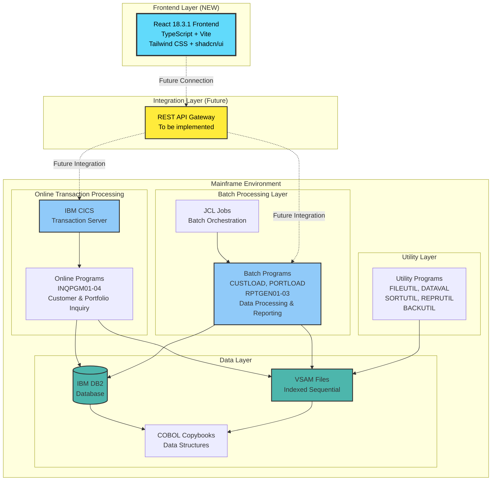

# System Architecture Diagram

## Overview

This document provides a visual representation of the COBOL Legacy Benchmark Suite architecture, showing both the existing COBOL mainframe components and the newly added React frontend interface.

## Current Architecture (After MBA-578)

## Architecture Components

### Frontend Layer (NEW - MBA-578)

**React Frontend**
- **Technology Stack**: React 18.3.1, TypeScript 5.6.2, Vite 6.0.1
- **UI Framework**: Tailwind CSS 3.4.16 with shadcn/ui component library
- **Purpose**: Modern web interface for the COBOL Legacy Benchmark Suite
- **Status**: ✅ Initialized and ready for feature development
- **Future Capabilities**:
  - Customer portfolio inquiry interface
  - Transaction processing dashboard
  - Reporting and analytics views
  - System administration console

### Integration Layer (Future Implementation)

**REST API Gateway**
- **Purpose**: Bridge between React frontend and COBOL mainframe systems
- **Status**: 🔄 To be implemented in future sprints
- **Planned Features**:
  - RESTful API endpoints for frontend consumption
  - Translation layer between HTTP and CICS/Batch protocols
  - Authentication and authorization
  - Request/response transformation
  - Error handling and logging

### Mainframe Environment (Existing)

#### Online Transaction Processing (CICS)
- **Programs**:
  - `INQPGM01`: Customer Inquiry
  - `INQPGM02`: Portfolio Inquiry
  - `INQPGM03`: Holdings Inquiry
  - `INQPGM04`: Transaction Inquiry
- **Purpose**: Real-time transaction processing and data inquiry
- **Integration**: Uses BMS maps for screen handling

#### Batch Processing Layer
- **Programs**:
  - `CUSTLOAD`: Customer data loading
  - `PORTLOAD`: Portfolio data loading
  - `RPTGEN01`: Daily Portfolio Report
  - `RPTGEN02`: Customer Activity Report
  - `RPTGEN03`: Holdings Summary Report
- **Orchestration**: JCL job control language scripts
- **Purpose**: Bulk data processing, reporting, and maintenance

#### Data Layer
- **DB2 Database**: Relational database for structured data
  - Customer tables
  - Portfolio tables
  - Holdings tables
  - Transaction history
- **VSAM Files**: Indexed sequential files for high-performance access
- **Copybooks**: COBOL data structure definitions shared across programs

#### Utility Layer
- **Programs**:
  - `FILEUTIL`: File operations and management
  - `DATAVAL`: Data validation utilities
  - `SORTUTIL`: Sorting and indexing
  - `REPRUTIL`: Report formatting
  - `BACKUTIL`: Backup and recovery
- **Purpose**: Common utilities shared across batch and online systems

## Integration Strategy (Roadmap)

### Phase 1: Frontend Foundation (✅ Complete)
- Initialize React + TypeScript + Vite project
- Set up development environment and tooling
- Create basic UI component library

### Phase 2: API Gateway Development (🔄 Planned)
- Design RESTful API specifications
- Implement API gateway service
- Create CICS/Batch integration adapters
- Add authentication and security layers

### Phase 3: Feature Implementation (🔄 Planned)
- Build customer inquiry interfaces
- Implement portfolio management views
- Create reporting dashboards
- Add transaction processing capabilities

### Phase 4: Testing & Deployment (🔄 Planned)
- Integration testing with COBOL backend
- Performance testing and optimization
- User acceptance testing
- Production deployment

## Technology Stack Summary

### Frontend
| Component | Technology | Version |
|-----------|-----------|---------|
| UI Framework | React | 18.3.1 |
| Language | TypeScript | 5.6.2 |
| Build Tool | Vite | 6.0.1 |
| Styling | Tailwind CSS | 3.4.16 |
| Components | shadcn/ui | Latest |
| Icons | Lucide React | 0.364.0 |
| Charts | Recharts | 2.12.4 |

### Backend (Existing)
| Component | Technology |
|-----------|-----------|
| Language | COBOL (Enterprise COBOL v6) |
| Transaction Server | IBM CICS |
| Database | IBM DB2 |
| File System | VSAM |
| Job Control | JCL |

## Notes

- The frontend is currently standalone and ready for feature development
- API integration layer will be designed and implemented in subsequent sprints
- All COBOL programs follow mainframe development standards
- The system is designed to benchmark LLM COBOL translation tools
- Architecture supports both modernization testing and production-grade operations
