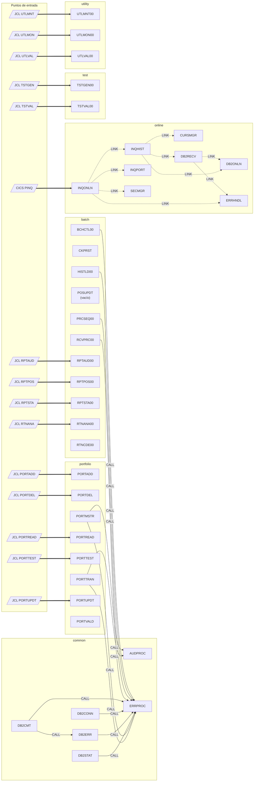

# Grafo de dependencias — COBOL Legacy Benchmark Suite

> Generado automáticamente por `tools/depgraph/build_dependency_graph.py` a partir de `src/`.
> No editar a mano: ejecutar `python3 tools/depgraph/build_dependency_graph.py` para regenerar.
> La documentación funcional de cada programa está en [`documentation/programs/`](../programs/README.md).

## Resumen

| Métrica | Valor |
| --- | --- |
| Programas COBOL | 38 |
| Copybooks | 20 |
| Jobs JCL | 15 |
| Tablas DB2 (DDL) | 6 |
| Programas vacíos | POSUPDT |
| CALL/LINK sin resolver (no existe el programa en `src/`) | — |
| COPY sin resolver (no existe el copybook en `src/`) | DB2STAT, PORTREC |
| Tablas DB2 sin DDL | AUDITLOG, AUTHFILE |
| Programas sin invocador conocido (ni CALL, ni JCL, ni CICS) | BCHCTL00, CKPRST, DB2CMT, DB2CONN, DB2STAT, HISTLD00, PORTMSTR, PORTTRAN, PORTVALD, POSUPDT, PRCSEQ00, RCVPRC00, RTNCDE00 |

## 1. Grafo de llamadas entre programas

Flechas continuas = `CALL` estático; discontinuas = `EXEC CICS LINK`; gruesas = punto de entrada (JCL `EXEC PGM=` o transacción CICS).

## 2. Acceso a datos (VSAM, DB2, BMS)

```mermaid
graph LR
  subgraph vsam["VSAM / QSAM (DDNAME)"]
    F_ACTUAL[("ACTUAL")]
    F_ALERTS[("ALERTS")]
    F_ARCHFILE[("ARCHFILE")]
    F_AUDFILE[("AUDFILE")]
    F_AUDITLOG[("AUDITLOG")]
    F_BCHCTL[("BCHCTL")]
    F_BCHSTATS[("BCHSTATS")]
    F_CKPTFILE[("CKPTFILE")]
    F_CTLFILE[("CTLFILE")]
    F_DB2STATS[("DB2STATS")]
    F_DELEFILE[("DELEFILE")]
    F_ERRLOG[("ERRLOG")]
    F_ERRRPT[("ERRRPT")]
    F_EXPECTED[("EXPECTED")]
    F_INPTFILE[("INPTFILE")]
    F_MONCFG[("MONCFG")]
    F_MONLOG[("MONLOG")]
    F_PORTFILE[("PORTFILE")]
    F_PORTOUT[("PORTOUT")]
    F_POSMSTRE[("POSMSTRE")]
    F_PRCSEQ[("PRCSEQ")]
    F_RANDSEED[("RANDSEED")]
    F_RPTFILE[("RPTFILE")]
    F_TESTCASE[("TESTCASE")]
    F_TESTFILE[("TESTFILE")]
    F_TESTRPT[("TESTRPT")]
    F_TRANFILE[("TRANFILE")]
    F_TRANHIST[("TRANHIST")]
    F_TRANOUT[("TRANOUT")]
    F_TSTCFG[("TSTCFG")]
    F_UPDTFILE[("UPDTFILE")]
    F_VALCTL[("VALCTL")]
  end
  subgraph db2["DB2"]
    T_AUDITLOG[("AUDITLOG")]
    T_AUTHFILE[("AUTHFILE")]
    T_ERRLOG[("ERRLOG")]
    T_POSHIST[("POSHIST")]
    T_RTNCODES[("RTNCODES")]
  end
  subgraph bms["BMS"]
    M_INQSET>"INQSET"]
  end
  BCHCTL00["BCHCTL00"]
  BCHCTL00 --> F_BCHCTL
  CKPRST["CKPRST"]
  CKPRST --> F_CKPTFILE
  HISTLD00["HISTLD00"]
  HISTLD00 --> F_TRANHIST
  HISTLD00 --> F_BCHCTL
  HISTLD00 -->|WRITE| T_POSHIST
  PRCSEQ00["PRCSEQ00"]
  PRCSEQ00 --> F_PRCSEQ
  PRCSEQ00 --> F_BCHCTL
  RCVPRC00["RCVPRC00"]
  RCVPRC00 --> F_BCHCTL
  RCVPRC00 --> F_PRCSEQ
  RPTAUD00["RPTAUD00"]
  RPTAUD00 --> F_AUDITLOG
  RPTAUD00 --> F_ERRLOG
  RPTAUD00 --> F_RPTFILE
  RPTPOS00["RPTPOS00"]
  RPTPOS00 --> F_POSMSTRE
  RPTPOS00 --> F_TRANHIST
  RPTPOS00 --> F_RPTFILE
  RPTSTA00["RPTSTA00"]
  RPTSTA00 --> F_DB2STATS
  RPTSTA00 --> F_BCHSTATS
  RPTSTA00 --> F_RPTFILE
  RTNANA00["RTNANA00"]
  RTNANA00 --> F_RPTFILE
  RTNANA00 -->|READ| T_RTNCODES
  RTNCDE00["RTNCDE00"]
  RTNCDE00 -->|READ/WRITE| T_RTNCODES
  AUDPROC["AUDPROC"]
  AUDPROC --> F_AUDFILE
  DB2ERR["DB2ERR"]
  DB2ERR -->|READ/WRITE| T_ERRLOG
  ERRPROC["ERRPROC"]
  ERRPROC --> F_ERRLOG
  ERRHNDL["ERRHNDL"]
  ERRHNDL -->|WRITE| T_ERRLOG
  INQHIST["INQHIST"]
  INQHIST <--> M_INQSET
  INQONLN["INQONLN"]
  INQONLN <--> M_INQSET
  INQPORT["INQPORT"]
  INQPORT <--> M_INQSET
  SECMGR["SECMGR"]
  SECMGR -->|WRITE| T_AUDITLOG
  SECMGR -->|READ| T_AUTHFILE
  PORTADD["PORTADD"]
  PORTADD --> F_PORTFILE
  PORTADD --> F_INPTFILE
  PORTDEL["PORTDEL"]
  PORTDEL --> F_PORTFILE
  PORTDEL --> F_DELEFILE
  PORTDEL --> F_AUDFILE
  PORTMSTR["PORTMSTR"]
  PORTMSTR --> F_PORTFILE
  PORTREAD["PORTREAD"]
  PORTREAD --> F_PORTFILE
  PORTTEST["PORTTEST"]
  PORTTEST --> F_TESTFILE
  PORTTRAN["PORTTRAN"]
  PORTTRAN --> F_TRANFILE
  PORTTRAN --> F_PORTFILE
  PORTUPDT["PORTUPDT"]
  PORTUPDT --> F_PORTFILE
  PORTUPDT --> F_UPDTFILE
  TSTGEN00["TSTGEN00"]
  TSTGEN00 --> F_TSTCFG
  TSTGEN00 --> F_PORTOUT
  TSTGEN00 --> F_TRANOUT
  TSTGEN00 --> F_RANDSEED
  TSTVAL00["TSTVAL00"]
  TSTVAL00 --> F_TESTCASE
  TSTVAL00 --> F_EXPECTED
  TSTVAL00 --> F_ACTUAL
  TSTVAL00 --> F_TESTRPT
  UTLMNT00["UTLMNT00"]
  UTLMNT00 --> F_CTLFILE
  UTLMNT00 --> F_ARCHFILE
  UTLMNT00 --> F_RPTFILE
  UTLMON00["UTLMON00"]
  UTLMON00 --> F_MONCFG
  UTLMON00 --> F_MONLOG
  UTLMON00 --> F_ALERTS
  UTLMON00 --> F_DB2STATS
  UTLVAL00["UTLVAL00"]
  UTLVAL00 --> F_VALCTL
  UTLVAL00 --> F_POSMSTRE
  UTLVAL00 --> F_TRANHIST
  UTLVAL00 --> F_ERRRPT
```

## 3. Uso de copybooks

```mermaid
graph TD
  C_BCHCON[["BCHCON"]]
  C_BCHCTL[["BCHCTL"]]
  C_CKPRST[["CKPRST"]]
  C_PRCSEQ[["PRCSEQ"]]
  C_AUDITLOG[["AUDITLOG"]]
  C_ERRHAND[["ERRHAND"]]
  C_HISTREC[["HISTREC"]]
  C_PORTFLIO[["PORTFLIO"]]
  C_PORTVAL[["PORTVAL"]]
  C_POSREC[["POSREC"]]
  C_RETHND[["RETHND"]]
  C_RTNCODE[["RTNCODE"]]
  C_TRNREC[["TRNREC"]]
  C_DBPROC[["DBPROC"]]
  C_DBTBLS[["DBTBLS"]]
  C_SQLCA[["SQLCA"]]
  C_DB2REQ[["DB2REQ"]]
  C_ERRHND[["ERRHND"]]
  C_INQCOM[["INQCOM"]]
  BCHCTL00["BCHCTL00"]
  BCHCTL00 --> C_BCHCON
  BCHCTL00 --> C_BCHCTL
  BCHCTL00 --> C_ERRHAND
  CKPRST["CKPRST"]
  CKPRST --> C_CKPRST
  CKPRST --> C_RETHND
  HISTLD00["HISTLD00"]
  HISTLD00 --> C_BCHCON
  HISTLD00 --> C_BCHCTL
  HISTLD00 --> C_DBPROC
  HISTLD00 --> C_DBTBLS
  HISTLD00 --> C_ERRHAND
  HISTLD00 --> C_HISTREC
  HISTLD00 --> C_SQLCA
  PRCSEQ00["PRCSEQ00"]
  PRCSEQ00 --> C_BCHCON
  PRCSEQ00 --> C_BCHCTL
  PRCSEQ00 --> C_ERRHAND
  PRCSEQ00 --> C_PRCSEQ
  RCVPRC00["RCVPRC00"]
  RCVPRC00 --> C_BCHCON
  RCVPRC00 --> C_BCHCTL
  RCVPRC00 --> C_ERRHAND
  RCVPRC00 --> C_PRCSEQ
  RPTAUD00["RPTAUD00"]
  RPTAUD00 --> C_AUDITLOG
  RPTAUD00 --> C_ERRHAND
  RPTAUD00 --> C_RTNCODE
  RPTPOS00["RPTPOS00"]
  RPTPOS00 --> C_ERRHAND
  RPTPOS00 --> C_POSREC
  RPTPOS00 --> C_RTNCODE
  RPTPOS00 --> C_TRNREC
  RPTSTA00["RPTSTA00"]
  RPTSTA00 --> C_BCHCTL
  RPTSTA00 --> C_DB2STAT
  RPTSTA00 --> C_ERRHAND
  RPTSTA00 --> C_RTNCODE
  RTNCDE00["RTNCDE00"]
  RTNCDE00 --> C_RTNCODE
  AUDPROC["AUDPROC"]
  AUDPROC --> C_AUDITLOG
  DB2CMT["DB2CMT"]
  DB2CMT --> C_DBPROC
  DB2CMT --> C_ERRHAND
  DB2CMT --> C_SQLCA
  DB2CONN["DB2CONN"]
  DB2CONN --> C_DBPROC
  DB2CONN --> C_ERRHAND
  DB2CONN --> C_SQLCA
  DB2ERR["DB2ERR"]
  DB2ERR --> C_DBPROC
  DB2ERR --> C_DBTBLS
  DB2ERR --> C_ERRHAND
  DB2ERR --> C_SQLCA
  DB2STAT["DB2STAT"]
  DB2STAT --> C_DBPROC
  DB2STAT --> C_ERRHAND
  DB2STAT --> C_SQLCA
  ERRPROC["ERRPROC"]
  ERRPROC --> C_ERRHAND
  DB2ONLN["DB2ONLN"]
  DB2ONLN --> C_ERRHND
  DB2RECV["DB2RECV"]
  DB2RECV --> C_DB2REQ
  DB2RECV --> C_ERRHND
  ERRHNDL["ERRHNDL"]
  ERRHNDL --> C_ERRHND
  INQHIST["INQHIST"]
  INQHIST --> C_INQCOM
  INQONLN["INQONLN"]
  INQONLN --> C_ERRHND
  INQONLN --> C_INQCOM
  INQPORT["INQPORT"]
  INQPORT --> C_INQCOM
  INQPORT --> C_POSREC
  SECMGR["SECMGR"]
  SECMGR --> C_ERRHND
  PORTADD["PORTADD"]
  PORTADD --> C_PORTFLIO
  PORTDEL["PORTDEL"]
  PORTDEL --> C_PORTFLIO
  PORTREAD["PORTREAD"]
  PORTREAD --> C_PORTFLIO
  PORTTEST["PORTTEST"]
  PORTTEST --> C_ERRHAND
  PORTTEST --> C_PORTFLIO
  PORTTRAN["PORTTRAN"]
  PORTTRAN --> C_AUDITLOG
  PORTTRAN --> C_ERRHAND
  PORTTRAN --> C_PORTREC
  PORTTRAN --> C_TRNREC
  PORTUPDT["PORTUPDT"]
  PORTUPDT --> C_PORTFLIO
  PORTVALD["PORTVALD"]
  PORTVALD --> C_PORTVAL
  TSTGEN00["TSTGEN00"]
  TSTGEN00 --> C_ERRHAND
  TSTGEN00 --> C_PORTFLIO
  TSTGEN00 --> C_RTNCODE
  TSTGEN00 --> C_TRNREC
  TSTVAL00["TSTVAL00"]
  TSTVAL00 --> C_ERRHAND
  TSTVAL00 --> C_RTNCODE
  UTLMNT00["UTLMNT00"]
  UTLMNT00 --> C_ERRHAND
  UTLMNT00 --> C_RTNCODE
  UTLMON00["UTLMON00"]
  UTLMON00 --> C_DB2STAT
  UTLMON00 --> C_ERRHAND
  UTLMON00 --> C_RTNCODE
  UTLVAL00["UTLVAL00"]
  UTLVAL00 --> C_ERRHAND
  UTLVAL00 --> C_POSREC
  UTLVAL00 --> C_RTNCODE
  UTLVAL00 --> C_TRNREC
```

## 4. Detalle por programa

| Programa | Categoría | Líneas | Invoca a | Invocado por | Copybooks | Ficheros (DD) | Tablas DB2 | BMS |
| --- | --- | --- | --- | --- | --- | --- | --- | --- |
| [BCHCTL00](../programs/BCHCTL00.md) | batch | 127 | ERRPROC | — | BCHCON, BCHCTL, ERRHAND | BCHCTL (INDEXED) | — | — |
| [CKPRST](../programs/CKPRST.md) | batch | 57 | — | — | CKPRST, RETHND | CKPTFILE (INDEXED) | — | — |
| [HISTLD00](../programs/HISTLD00.md) | batch | 233 | ERRPROC | — | BCHCON, BCHCTL, DBPROC, DBTBLS, ERRHAND, HISTREC, SQLCA | TRANHIST (INDEXED), BCHCTL (INDEXED) | POSHIST (WRITE) | — |
| [POSUPDT](../programs/POSUPDT.md) | batch | 1 | — | — | — | — | — | — |
| [PRCSEQ00](../programs/PRCSEQ00.md) | batch | 345 | ERRPROC | — | BCHCON, BCHCTL, ERRHAND, PRCSEQ | PRCSEQ (INDEXED), BCHCTL (INDEXED) | — | — |
| [RCVPRC00](../programs/RCVPRC00.md) | batch | 302 | ERRPROC | — | BCHCON, BCHCTL, ERRHAND, PRCSEQ | BCHCTL (INDEXED), PRCSEQ (INDEXED) | — | — |
| [RPTAUD00](../programs/RPTAUD00.md) | batch | 147 | — | JCL:RPTAUD | AUDITLOG, ERRHAND, RTNCODE | AUDITLOG (INDEXED), ERRLOG (INDEXED), RPTFILE (SEQUENTIAL) | — | — |
| [RPTPOS00](../programs/RPTPOS00.md) | batch | 160 | — | JCL:RPTPOS | ERRHAND, POSREC, RTNCODE, TRNREC | POSMSTRE (INDEXED), TRANHIST (INDEXED), RPTFILE (SEQUENTIAL) | — | — |
| [RPTSTA00](../programs/RPTSTA00.md) | batch | 185 | — | JCL:RPTSTA | BCHCTL, DB2STAT, ERRHAND, RTNCODE | DB2STATS (INDEXED), BCHSTATS (INDEXED), RPTFILE (SEQUENTIAL) | — | — |
| [RTNANA00](../programs/RTNANA00.md) | batch | 210 | — | JCL:RTNANA | — | RPTFILE (SEQUENTIAL) | RTNCODES (READ) | — |
| [RTNCDE00](../programs/RTNCDE00.md) | batch | 141 | — | — | RTNCODE | — | RTNCODES (READ/WRITE) | — |
| [AUDPROC](../programs/AUDPROC.md) | common | 96 | — | PORTMSTR, PORTTRAN | AUDITLOG | AUDFILE (SEQUENTIAL) | — | — |
| [DB2CMT](../programs/DB2CMT.md) | common | 170 | DB2ERR, ERRPROC | — | DBPROC, ERRHAND, SQLCA | — | — | — |
| [DB2CONN](../programs/DB2CONN.md) | common | 154 | ERRPROC | — | DBPROC, ERRHAND, SQLCA | — | — | — |
| [DB2ERR](../programs/DB2ERR.md) | common | 200 | ERRPROC | DB2CMT | DBPROC, DBTBLS, ERRHAND, SQLCA | — | ERRLOG (READ/WRITE) | — |
| [DB2STAT](../programs/DB2STAT.md) | common | 228 | ERRPROC | — | DBPROC, ERRHAND, SQLCA | — | — | — |
| [ERRPROC](../programs/ERRPROC.md) | common | 107 | — | BCHCTL00, DB2CMT, DB2CONN, DB2ERR, DB2STAT, HISTLD00, PORTMSTR, PORTTRAN, PRCSEQ00, RCVPRC00 | ERRHAND | ERRLOG (SEQUENTIAL) | — | — |
| [CURSMGR](../programs/CURSMGR.md) | online | 91 | — | INQHIST | — | — | — | — |
| [DB2ONLN](../programs/DB2ONLN.md) | online | 120 | — | DB2RECV, INQHIST | ERRHND | — | — | — |
| [DB2RECV](../programs/DB2RECV.md) | online | 145 | DB2ONLN (LINK), ERRHNDL (LINK) | INQHIST | DB2REQ, ERRHND | — | — | — |
| [ERRHNDL](../programs/ERRHNDL.md) | online | 118 | — | DB2RECV, INQONLN | ERRHND | — | ERRLOG (WRITE) | — |
| [INQHIST](../programs/INQHIST.md) | online | 193 | CURSMGR (LINK), DB2ONLN (LINK), DB2RECV (LINK) | INQONLN | INQCOM | — | — | INQSET |
| [INQONLN](../programs/INQONLN.md) | online | 171 | ERRHNDL (LINK), INQHIST (LINK), INQPORT (LINK), SECMGR (LINK) | CICS:PINQ | ERRHND, INQCOM | — | — | INQSET |
| [INQPORT](../programs/INQPORT.md) | online | 110 | — | INQONLN | INQCOM, POSREC | — | — | INQSET |
| [SECMGR](../programs/SECMGR.md) | online | 135 | — | INQONLN | ERRHND | — | AUDITLOG (WRITE), AUTHFILE (READ) | — |
| [PORTADD](../programs/PORTADD.md) | portfolio | 148 | — | JCL:PORTADD | PORTFLIO | PORTFILE (INDEXED), INPTFILE (SEQUENTIAL) | — | — |
| [PORTDEL](../programs/PORTDEL.md) | portfolio | 194 | — | JCL:PORTDEL | PORTFLIO | PORTFILE (INDEXED), DELEFILE (SEQUENTIAL), AUDFILE (SEQUENTIAL) | — | — |
| [PORTMSTR](../programs/PORTMSTR.md) | portfolio | 288 | AUDPROC, ERRPROC | — | — | PORTFILE (INDEXED) | — | — |
| [PORTREAD](../programs/PORTREAD.md) | portfolio | 111 | — | JCL:PORTREAD | PORTFLIO | PORTFILE (INDEXED) | — | — |
| [PORTTEST](../programs/PORTTEST.md) | portfolio | 119 | — | JCL:PORTTEST | ERRHAND, PORTFLIO | TESTFILE (SEQUENTIAL) | — | — |
| [PORTTRAN](../programs/PORTTRAN.md) | portfolio | 317 | AUDPROC, ERRPROC | — | AUDITLOG, ERRHAND, PORTREC, TRNREC | TRANFILE (SEQUENTIAL), PORTFILE (INDEXED) | — | — |
| [PORTUPDT](../programs/PORTUPDT.md) | portfolio | 160 | — | JCL:PORTUPDT | PORTFLIO | PORTFILE (INDEXED), UPDTFILE (SEQUENTIAL) | — | — |
| [PORTVALD](../programs/PORTVALD.md) | portfolio | 120 | — | — | PORTVAL | — | — | — |
| [TSTGEN00](../programs/TSTGEN00.md) | test | 216 | — | JCL:TSTGEN | ERRHAND, PORTFLIO, RTNCODE, TRNREC | TSTCFG (SEQUENTIAL), PORTOUT (SEQUENTIAL), TRANOUT (SEQUENTIAL), RANDSEED (SEQUENTIAL) | — | — |
| [TSTVAL00](../programs/TSTVAL00.md) | test | 225 | — | JCL:TSTVAL | ERRHAND, RTNCODE | TESTCASE (SEQUENTIAL), EXPECTED (SEQUENTIAL), ACTUAL (SEQUENTIAL), TESTRPT (SEQUENTIAL) | — | — |
| [UTLMNT00](../programs/UTLMNT00.md) | utility | 182 | — | JCL:UTLMNT | ERRHAND, RTNCODE | CTLFILE (SEQUENTIAL), ARCHFILE (SEQUENTIAL), RPTFILE (SEQUENTIAL) | — | — |
| [UTLMON00](../programs/UTLMON00.md) | utility | 221 | — | JCL:UTLMON | DB2STAT, ERRHAND, RTNCODE | MONCFG (SEQUENTIAL), MONLOG (SEQUENTIAL), ALERTS (SEQUENTIAL), DB2STATS (INDEXED) | — | — |
| [UTLVAL00](../programs/UTLVAL00.md) | utility | 190 | — | JCL:UTLVAL | ERRHAND, POSREC, RTNCODE, TRNREC | VALCTL (SEQUENTIAL), POSMSTRE (INDEXED), TRANHIST (INDEXED), ERRRPT (SEQUENTIAL) | — | — |

## 5. Copybooks

| Copybook | Categoría | Ruta | Usado por | Contiene lógica |
| --- | --- | --- | --- | --- |
| BCHCON | batch | `src/copybook/batch/BCHCON.cpy` | BCHCTL00, HISTLD00, PRCSEQ00, RCVPRC00 | no |
| BCHCTL | batch | `src/copybook/batch/BCHCTL.cpy` | BCHCTL00, HISTLD00, PRCSEQ00, RCVPRC00, RPTSTA00 | no |
| CKPRST | batch | `src/copybook/batch/CKPRST.cpy` | CKPRST | no |
| PRCSEQ | batch | `src/copybook/batch/PRCSEQ.cpy` | PRCSEQ00, RCVPRC00 | no |
| AUDITLOG | common | `src/copybook/common/AUDITLOG.cpy` | AUDPROC, PORTTRAN, RPTAUD00 | no |
| COMMON | common | `src/copybook/common/COMMON.cpy` | — | no |
| ERRHAND | common | `src/copybook/common/ERRHAND.cpy` | BCHCTL00, DB2CMT, DB2CONN, DB2ERR, DB2STAT, ERRPROC, HISTLD00, PORTTEST, PORTTRAN, PRCSEQ00, RCVPRC00, RPTAUD00, RPTPOS00, RPTSTA00, TSTGEN00, TSTVAL00, UTLMNT00, UTLMON00, UTLVAL00 | no |
| HISTREC | common | `src/copybook/common/HISTREC.cpy` | HISTLD00 | no |
| PORTFLIO | common | `src/copybook/common/PORTFLIO.cpy` | PORTADD, PORTDEL, PORTREAD, PORTTEST, PORTUPDT, TSTGEN00 | no |
| PORTVAL | common | `src/copybook/common/PORTVAL.cpy` | PORTVALD | no |
| POSREC | common | `src/copybook/common/POSREC.cpy` | INQPORT, RPTPOS00, UTLVAL00 | no |
| RETHND | common | `src/copybook/common/RETHND.cpy` | CKPRST | no |
| RTNCODE | common | `src/copybook/common/RTNCODE.cpy` | RPTAUD00, RPTPOS00, RPTSTA00, RTNCDE00, TSTGEN00, TSTVAL00, UTLMNT00, UTLMON00, UTLVAL00 | no |
| TRNREC | common | `src/copybook/common/TRNREC.cpy` | PORTTRAN, RPTPOS00, TSTGEN00, UTLVAL00 | no |
| DBPROC | db2 | `src/copybook/db2/DBPROC.cpy` | DB2CMT, DB2CONN, DB2ERR, DB2STAT, HISTLD00 | sí |
| DBTBLS | db2 | `src/copybook/db2/DBTBLS.cpy` | DB2ERR, HISTLD00 | no |
| SQLCA | db2 | `src/copybook/db2/SQLCA.cpy` | DB2CMT, DB2CONN, DB2ERR, DB2STAT, HISTLD00 | sí |
| DB2REQ | online | `src/copybook/online/DB2REQ.cpy` | DB2RECV | no |
| ERRHND | online | `src/copybook/online/ERRHND.cpy` | DB2ONLN, DB2RECV, ERRHNDL, INQONLN, SECMGR | no |
| INQCOM | online | `src/copybook/online/INQCOM.cpy` | INQHIST, INQONLN, INQPORT | no |

## 6. Jobs JCL

| JCL | Categoría | Pasos (PGM) | Datasets |
| --- | --- | --- | --- |
| RTNANA | jcl | RTNANA=RTNANA00 | RPTFILE→SYSOUT |
| RPTAUD | batch | STEP01=RPTAUD00 | AUDITLOG→PROD.AUDIT.LOG, ERRLOG→PROD.ERROR.LOG, RPTFILE→PROD.AUDIT.REPORT |
| RPTPOS | batch | STEP01=RPTPOS00 | POSMSTRE→PROD.POSITION.MASTER, TRANHIST→PROD.TRANSACTION.HISTORY, RPTFILE→PROD.DAILY.POSITION.REPORT |
| RPTSTA | batch | STEP01=RPTSTA00 | DB2STATS→PROD.DB2.STATISTICS, BCHSTATS→PROD.BATCH.STATISTICS, RPTFILE→PROD.SYSTEM.STATS.REPORT |
| PORTADD | portfolio | STEP1=PORTADD | PORTFILE→PORTFOLIO.MASTER.FILE, INPTFILE→PORTFOLIO.INPUT.FILE |
| PORTDEF | portfolio | DEFVSAM=IDCAMS | — |
| PORTDEL | portfolio | STEP1=PORTDEL | PORTFILE→PORTFOLIO.MASTER.FILE, DELEFILE→PORTFOLIO.DELETE.FILE, AUDFILE→PORTFOLIO.AUDIT.FILE |
| PORTREAD | portfolio | STEP1=PORTREAD | PORTFILE→PORTFOLIO.MASTER.FILE |
| PORTTEST | portfolio | STEP1=PORTTEST | TESTFILE→PORTFOLIO.TEST.FILE |
| PORTUPDT | portfolio | STEP1=PORTUPDT | PORTFILE→PORTFOLIO.MASTER.FILE, UPDTFILE→PORTFOLIO.UPDATE.FILE |
| TSTGEN | test | STEP01=TSTGEN00 | TSTCFG→TEST.CONFIG.FILE, PORTOUT→TEST.PORTFOLIO.DATA, TRANOUT→TEST.TRANSACTION.DATA, RANDSEED→TEST.RANDOM.SEED |
| TSTVAL | test | STEP01=TSTVAL00 | TESTCASE→TEST.CASE.FILE, EXPECTED→TEST.EXPECTED.RESULTS, ACTUAL→TEST.ACTUAL.RESULTS, TESTRPT→TEST.VALIDATION.REPORT |
| UTLMNT | utility | STEP01=UTLMNT00 | CTLFILE→PROD.CONTROL.FILE, ARCHFILE→PROD.ARCHIVE.FILE, RPTFILE→PROD.MAINTENANCE.REPORT |
| UTLMON | utility | STEP01=UTLMON00 | MONCFG→PROD.MONITOR.CONFIG, MONLOG→PROD.MONITOR.LOG, ALERTS→PROD.MONITOR.ALERTS, DB2STATS→PROD.DB2.STATISTICS |
| UTLVAL | utility | STEP01=UTLVAL00 | VALCTL→PROD.VALIDATION.CONTROL, POSMSTRE→PROD.POSITION.MASTER, TRANHIST→PROD.TRANSACTION.HISTORY, ERRRPT→PROD.VALIDATION.REPORT |

## 7. Recursos CICS (PORTDFN.csd)

| Transacción | Programa inicial |
| --- | --- |
| PINQ | INQONLN |

Programas definidos: INQONLN, INQPORT, INQHIST, DB2ONLN, CURSMGR, DB2RECV, SECMGR. Mapsets: INQSET. Ficheros: POSFILE.

## 8. Tablas DB2 (DDL)

| Tabla | DDL |
| --- | --- |
| ERRLOG | `src/database/db2/ERRLOG.sql` |
| POSHIST | `src/database/db2/POSHIST.sql` |
| RTNCODES | `src/database/db2/RTNCODES.sql` |
| PORTFOLIO_MASTER | `src/database/db2/db2-definitions.sql` |
| INVESTMENT_POSITIONS | `src/database/db2/db2-definitions.sql` |
| TRANSACTION_HISTORY | `src/database/db2/db2-definitions.sql` |
