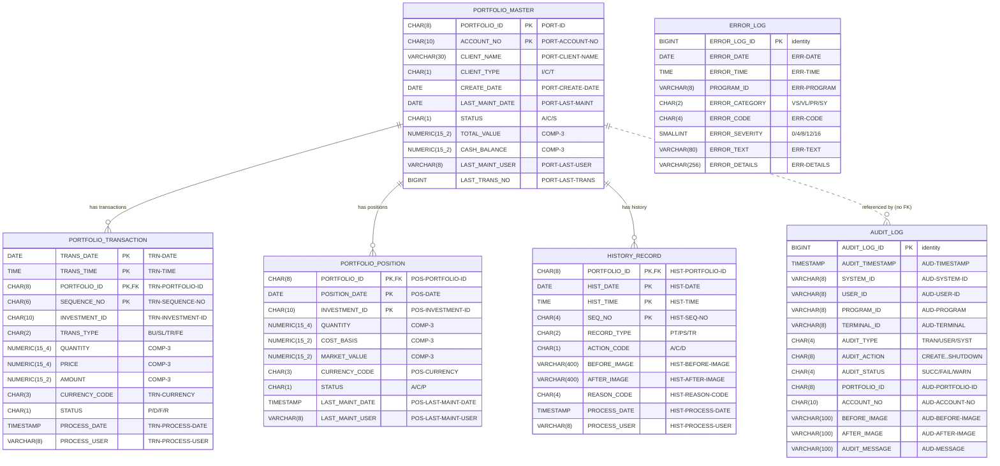

# Entity-Relationship Diagram — Portfolio Baseline Schema

Relational schema translated from the VSAM copybooks (see `FIELD_MAPPINGS.md` and
`ddl/V1__baseline_schema.sql`).

Notes:
- `PORTFOLIO_MASTER` has a composite VSAM key `(PORTFOLIO_ID, ACCOUNT_NO)`; child tables key on
  `PORTFOLIO_ID` alone (matching the copybook child-record keys), backed by a `UNIQUE` constraint
  on `PORTFOLIO_MASTER.PORTFOLIO_ID`.
- `ERROR_LOG` and `AUDIT_LOG` are insert-only log tables with surrogate identity keys; `AUDIT_LOG`
  references portfolios informally (nullable columns, no FK) because audit rows may record events
  for portfolios that no longer exist.
