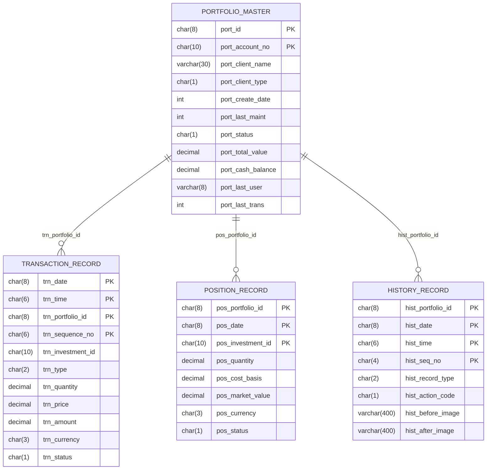

# Copybook → Relational Field Mappings (Phase 0, task 0.2)

This document records the translation of the VSAM record copybooks into the
relational schema (`java/portfolio/src/main/resources/db/migration/V1__create_portfolio_schema.sql`)
and the JPA entities (`java/portfolio/src/main/java/com/clbs/portfolio/domain/`).

## Type translation rules

| COBOL PIC clause | SQL column | Java type | Notes |
|---|---|---|---|
| `PIC X(n)` | `CHAR(n)` (keys) / `VARCHAR(n)` (audit) | `String` | Left-justified, space-padded in fixtures |
| `PIC 9(8)` (date) | `INTEGER` | `Integer` | Raw `YYYYMMDD`, preserves byte parity for the parallel run |
| `PIC S9(13)V99 COMP-3` | `DECIMAL(15,2)` | `BigDecimal` (scale 2) | Money; HALF_UP rounding (`Comp3.money`) |
| `PIC S9(11)V9(4) COMP-3` | `DECIMAL(15,4)` | `BigDecimal` (scale 4) | Quantity/price (`Comp3.quantity`) |

> **Never** map COMP-3 to `double`/`float`. COBOL fixed-point arithmetic is
> reproduced with `BigDecimal` at the copybook-declared scale.

## ERD

## PORTFLIO.cpy → `portfolio_master`

| Copybook field | PIC | Column | Type |
|---|---|---|---|
| PORT-ID | X(8) | port_id (PK) | CHAR(8) |
| PORT-ACCOUNT-NO | X(10) | port_account_no (PK) | CHAR(10) |
| PORT-CLIENT-NAME | X(30) | port_client_name | VARCHAR(30) |
| PORT-CLIENT-TYPE | X(1) | port_client_type | CHAR(1) — I/C/T |
| PORT-CREATE-DATE | 9(8) | port_create_date | INTEGER |
| PORT-LAST-MAINT | 9(8) | port_last_maint | INTEGER |
| PORT-STATUS | X(1) | port_status | CHAR(1) — A/C/S |
| PORT-TOTAL-VALUE | S9(13)V99 COMP-3 | port_total_value | DECIMAL(15,2) |
| PORT-CASH-BALANCE | S9(13)V99 COMP-3 | port_cash_balance | DECIMAL(15,2) |
| PORT-LAST-USER | X(8) | port_last_user | VARCHAR(8) |
| PORT-LAST-TRANS | 9(8) | port_last_trans | INTEGER |
| PORT-FILLER | X(50) | port_filler | VARCHAR(50) |

## TRNREC.cpy → `transaction_record`

| Copybook field | PIC | Column | Type |
|---|---|---|---|
| TRN-DATE | X(08) | trn_date (PK) | CHAR(8) |
| TRN-TIME | X(06) | trn_time (PK) | CHAR(6) |
| TRN-PORTFOLIO-ID | X(08) | trn_portfolio_id (PK) | CHAR(8) |
| TRN-SEQUENCE-NO | X(06) | trn_sequence_no (PK) | CHAR(6) |
| TRN-INVESTMENT-ID | X(10) | trn_investment_id | CHAR(10) |
| TRN-TYPE | X(02) | trn_type | CHAR(2) — BU/SL/TR/FE |
| TRN-QUANTITY | S9(11)V9(4) COMP-3 | trn_quantity | DECIMAL(15,4) |
| TRN-PRICE | S9(11)V9(4) COMP-3 | trn_price | DECIMAL(15,4) |
| TRN-AMOUNT | S9(13)V9(2) COMP-3 | trn_amount | DECIMAL(15,2) |
| TRN-CURRENCY | X(03) | trn_currency | CHAR(3) |
| TRN-STATUS | X(01) | trn_status | CHAR(1) — P/D/F/R |
| TRN-PROCESS-DATE | X(26) | trn_process_date | CHAR(26) |
| TRN-PROCESS-USER | X(08) | trn_process_user | VARCHAR(8) |
| TRN-FILLER | X(50) | trn_filler | VARCHAR(50) |

## POSREC.cpy → `position_record`

| Copybook field | PIC | Column | Type |
|---|---|---|---|
| POS-PORTFOLIO-ID | X(08) | pos_portfolio_id (PK) | CHAR(8) |
| POS-DATE | X(08) | pos_date (PK) | CHAR(8) |
| POS-INVESTMENT-ID | X(10) | pos_investment_id (PK) | CHAR(10) |
| POS-QUANTITY | S9(11)V9(4) COMP-3 | pos_quantity | DECIMAL(15,4) |
| POS-COST-BASIS | S9(13)V9(2) COMP-3 | pos_cost_basis | DECIMAL(15,2) |
| POS-MARKET-VALUE | S9(13)V9(2) COMP-3 | pos_market_value | DECIMAL(15,2) |
| POS-CURRENCY | X(03) | pos_currency | CHAR(3) |
| POS-STATUS | X(01) | pos_status | CHAR(1) — A/C/P |
| POS-LAST-MAINT-DATE | X(26) | pos_last_maint_date | VARCHAR(26) |
| POS-LAST-MAINT-USER | X(08) | pos_last_maint_user | VARCHAR(8) |
| POS-FILLER | X(50) | pos_filler | VARCHAR(50) |

## HISTREC.cpy → `history_record`

| Copybook field | PIC | Column | Type |
|---|---|---|---|
| HIST-PORTFOLIO-ID | X(08) | hist_portfolio_id (PK) | CHAR(8) |
| HIST-DATE | X(08) | hist_date (PK) | CHAR(8) |
| HIST-TIME | X(06) | hist_time (PK) | CHAR(6) |
| HIST-SEQ-NO | X(04) | hist_seq_no (PK) | CHAR(4) |
| HIST-RECORD-TYPE | X(02) | hist_record_type | CHAR(2) — PT/PS/TR |
| HIST-ACTION-CODE | X(01) | hist_action_code | CHAR(1) — A/C/D |
| HIST-BEFORE-IMAGE | X(400) | hist_before_image | VARCHAR(400) |
| HIST-AFTER-IMAGE | X(400) | hist_after_image | VARCHAR(400) |
| HIST-REASON-CODE | X(04) | hist_reason_code | VARCHAR(4) |
| HIST-PROCESS-DATE | X(26) | hist_process_date | CHAR(26) |
| HIST-PROCESS-USER | X(08) | hist_process_user | VARCHAR(8) |
| HIST-FILLER | X(50) | hist_filler | VARCHAR(50) |

## VSAM KSDS → repository access patterns

| VSAM file | KSDS key | Repository | Access methods |
|---|---|---|---|
| PORTMSTR | PORT-KEY | `PortfolioMasterRepository` | full-key `findById`, partial-key `findByKeyPortId`, browse `findByKeyPortIdGreaterThanEqual...` (STARTBR/READNEXT) |
| TRANHIST | TRN-KEY | `TransactionRecordRepository` | browse by portfolio, by date range |
| POSHIST | POS-KEY | `PositionRecordRepository` | by portfolio + as-of date |
| (history) | HIST-KEY | `HistoryRecordRepository` | by portfolio, by record type |

## Notes / deviations
- The legacy DB2 DDL (`src/database/db2/db2-definitions.sql`) diverges from the
  copybooks (extra `BRANCH_ID`, `RISK_LEVEL`, etc.). Per task 0.4 the entities
  must match the **copybooks** exactly, so the schema is derived from the
  copybook record layouts, not the DB2 tables.
- `PIC 9(8)` date fields are kept as raw `INTEGER` (not `DATE`) so the
  parallel-run comparison can diff Java output against COBOL output byte-for-byte.
  A future phase can add `LocalDate` view converters once parity is proven.
